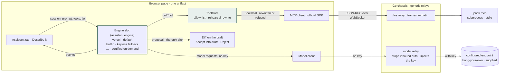

# Make the assistant engine a slot behind one contract

## Context and problem statement

The desk gains an assistant (strategy: `oss-protoss-feature-boundary.md`, amended 2026-09-03).
The strategy fixes what it is: a **slot on the identity pattern** — `none` by default (the desk
ships keyless), `bring-your-own` (an OpenAI-compatible or Anthropic endpoint and key configured
in Admin; the key stays on this machine and never lands in a project file), or `supplied` (an
endpoint someone operates for you, in the same fields). It runs the runtime's own authoring
prompts with the runtime's tools — `get_schema`, `get_example`, `validate`, and
`experimental_evaluate` **in rehearsal only, always** — and it can only **propose**: a diff on the
draft with Accept into draft and Reject, the accept going through the same span-preserving writer
a form edit uses. It never writes a file and never states a verdict of its own.

The strategy does not say what runs the loop. That is this record's question: **which agent
framework, and how the choice is made so that it does not become a load-bearing dependency of
the contract above.**

Two facts about this desk bound the answer. It is **one Go binary with an embedded page**, and
the **browser is the MCP client**: the page talks to a per-session `jpack mcp` subprocess over a
WebSocket the chassis relays verbatim, and the chassis "has no per-feature endpoints and parses
none of the traffic it carries" (README). Anything that runs the loop either runs in the page, or
turns the chassis into a feature server, or ships beside the binary.

On 2026-09-05 a bake-off measured eight candidates against the contract, with no real model and no
key: a scripted endpoint speaking both the OpenAI chat-completions and Anthropic messages wire
formats replayed one deterministic "Describe it" session (schema, examples, an invalid draft, a
valid draft, an evaluate call sent **without** the rehearsal flag, a write attempt, a proposal, and
in thinking mode a refutation pass), while the real `jpack mcp` answered the tool calls in a project
copy that declared an audit trail, so an unguarded evaluate would have left a record. Every
prototype had to emit the same event stream and pass the same checker; each was reproduced and
mutation-checked by adversarial verifiers; three judges scored, a critic looked for gaps, and a
memo was synthesized. Three results decide this record:

1. **The contract held across all eight.** Same session, same tools from the server's `tools/list`,
   same events, same checker, and five browser candidates ran the whole session **with no key in
   the page** behind a relay that injects it. The loop is replaceable; the seams around it are the
   desk's.
2. **The guardrails hold below the framework.** Two prototypes enforced the rehearsal rewrite and
   the tool allow-list on the MCP transport itself, one level under whatever framework ran the
   loop, and mutation checks proved that layer alone keeps the audit trail empty and the project
   tree unchanged. A guardrail placed there cannot be weakened by swapping the engine.
3. **What separates the frameworks moves.** The Vercel AI SDK won overall (mean 55.3 of 63) with
   the hand-written loop second (52.7), and the judges split two to one on exactly one criterion:
   fidelity of Claude extended thinking across tool turns — a property decided by open defects
   with dates (`vercel/ai#19663` reproduced on the shipped release, `langchainjs#10744` open since
   April, an undocumented `reasoningItemIdPolicy` in the OpenAI SDK). A framework choice that
   rests on this year's defect list is not a choice to hard-wire.

## Decision drivers

- **The contract must hold whatever runs the loop.** Propose-only, rehearsal-only, the five-tool
  allow-list, and key custody are the desk's promises, not a framework's features.
- **One artifact; the browser is the MCP client; the chassis stays generic.** An engine that needs
  a runtime beside the binary, or a feature endpoint in the chassis, spends invariants the strategy
  bought deliberately.
- **Vendor neutrality one level up.** The endpoint slot exists so the desk never prefers a model
  vendor. An engine slot is the same principle applied to the loop.
- **The maintainer's amendment (2026-09-05): critical thinking on when a thinking mode is on.**
  The engine must run the model's reasoning at the chosen depth and a refutation pass against the
  runtime before presenting, and degrade visibly when the endpoint offers no thinking. The
  frameworks differ most here, and their differences are defects that change between releases.
- **Bundle cost, dependency surface, and maintenance** — measured, not estimated, per framework.
- **Testability without a network.** The scenario that judged the frameworks is the shape the
  desk's own suite should have: deterministic, keyless, and able to catch a guardrail that fails
  open.

## Considered options

1. **Hard-wire the winning framework** (Vercel AI SDK) into the assistant.
2. **Hand-write the loop** on the MCP SDK client and `fetch`, no framework.
3. **An engine slot behind one contract**, certified adapters, browser only, with a default and a
   keyless built-in fallback.
4. **The engine behind the endpoint** — the configured endpoint is an agent service, not a model.
5. **Engines in the chassis** (a Go framework).
6. **A sidecar engine** (Python or Node) shipped beside the binary.

## Decision outcome

**Option 3.** The assistant engine is a configurable slot. The desk defines one contract; each
framework is an adapter that implements it; adapters ship only when they pass the desk's
conformance session; the desk enforces the guardrails and key custody **below** the adapter, so
a user's choice of engine cannot weaken the contract. Two adapters ship first — `vercel` as the
default and `builtin` as the keyless fallback — and others are certified on demand.

The engine is the one swappable box. Everything it can reach passes through a seam the desk
owns, and swapping the engine changes none of the seams:



### The slot

`assistant.engine` is a desk-level setting in `desk.json`, beside the endpoint slot the strategy
defines, a string naming a certified engine, default `vercel`. `assistant.thinking` is the tier,
`off` by default. Exact spellings land with chunk 1's decoder and its refusals, on the identity
slot's precedent: one field, no vendor discriminator, unknown values refused by name.

```json
{
  "identity":  { "provider": null },
  "assistant": { "endpoint": { "family": "openai-compatible", "baseUrl": "…", "model": "…" },
                 "engine": "vercel",
                 "thinking": "off" }
}
```

### The contract

An engine is a module the page loads for the session. It receives everything the desk has
already decided and returns a stream of events. Accept and Reject are the desk's actions on the
proposal event, through the span-preserving writer; they are not engine calls.

```ts
interface AssistantEngine {
  readonly id: string
  start(session: AssistantSession): AsyncIterable<AssistantEvent>
}

interface AssistantSession {
  prompt: string                          // the runtime's prompt text, from prompts/get
  tools: McpTool[]                        // the five, exactly as tools/list served them
  callTool(name: string, args: unknown): Promise<McpToolResult>   // bound through the ToolGate
  model: { family: 'openai-compatible' | 'anthropic'; baseUrl: string; model: string }  // baseUrl is the chassis relay
  thinking: { tier: 'off' | 'on' | 'ultra' }
  signal: AbortSignal
}

type AssistantEvent =
  | { type: 'reasoning'; text: string; done: boolean }
  | { type: 'tool_call'; name: string; args: unknown }
  | { type: 'tool_result'; name: string; isError: boolean; text: string; structured?: unknown }
  | { type: 'guardrail'; tool: string; action: 'rewrote' | 'refused'; detail: string }
  | { type: 'thinking_unavailable'; detail: string }
  | { type: 'critique'; refuted: boolean; checks: { tool: string; status: string }[]; text: string }
  | { type: 'proposal'; document: unknown; unknowns: string[]; critique?: { refuted: boolean } }
  | { type: 'error'; message: string }
  | { type: 'end' }
```

This is the event stream every bake-off prototype emitted and the checker read. It is deliberately
smaller than any framework's API: what a framework offers beyond it (its own approval pause, its
own memory, its own file tools) stays inside the adapter or is not used.

### Guardrails below the engine

- **ToolGate**, on the desk's MCP transport. Every outbound `tools/call` frame is checked by name
  against the allow-list and refused otherwise; `experimental_evaluate` is rewritten to carry
  `rehearsal: true` before the frame leaves the page. The engine's `callTool` is bound through the
  gate and the engine never holds the raw client. This is the layer the bake-off proved holds
  alone under mutation, and it is desk code, mutation-tested in the desk's own suite.
- **The model relay**, in the chassis. The page sends model requests to the chassis without a
  credential; the chassis strips any inbound auth header, injects the configured key, and forwards
  `/v1/*` verbatim, in the spirit of the WebSocket relay. The bake-off's 280-line Go reference ran
  every browser candidate's full session with `keyInPage: false` on every proxied request, and a
  bypass control that put the key in the page failed on browser CORS.
- **The proposal is the only sink.** The desk renders the diff and applies an accepted proposal
  through the span-preserving writer. No engine event writes anything.

### Browser only, one artifact

Engines are ES modules, one lazily loaded chunk per engine id. The release carries every certified
chunk; a session downloads one. Go engines are not adapters (they would make the chassis a feature
server) and Python engines cannot ship (a runtime beside the binary). Both are recorded below with
their measurements, so the decision can be revisited if the chassis principle ever changes.

### Certification

An engine ships only if it passes the desk's conformance session in CI, which is the bake-off
scenario carried into the repository: the plain leg, the Anthropic leg, the thinking leg (the tier
parameter on every request, thinking blocks carried back verbatim after every tool result, reasoning
streamed as events, the refutation pass run **only** when the tier is on), the no-thinking leg (a
400 on the parameter degrades once and the session completes), and the relay leg (no key in the
page). The suite must be shown to fail: each guardrail is mutated and the checker goes red before
the pass counts.

### Thinking, normalized in the desk

The tier maps to provider parameters in one desk-owned table, per endpoint family, and the engine
receives the normalized result. The slot has five states, three of them measured: `off`, `on`,
`ultra`, **"this model always thinks"** (current Claude models reject a disable), and
**"unavailable for this endpoint"** (a 400 on the parameter, or no thinking block after the first
turn). No framework supplies the last two; they are desk code whichever engine runs.

### The refutation pass

Implemented per engine on the framework's natural primitive (a critic subagent, a graph node, a
prepare-step hook, an output guardrail), gated on the tier, and held to three desk rules the
bake-off showed no prototype kept on its own: a non-empty list of checks before "not refuted" is
rendered; the verdict is never taken from the model's prose, only from the runtime's results; and
the critic runs inside the same ToolGate as the main loop.

### Ship order

1. `builtin` and `vercel`, in the assistant chunks already planned (slot and key custody; the
   Assistant tab with propose and accept-into-draft; "Describe it"; the thinking tier; the
   refutation pass).
2. Any further engine is one PR: the adapter, its conformance run, and its row in the table below.

### Consequences

Good:

- The contract and its guardrails are the desk's and stay verified regardless of engine.
- Switching cost is bounded to an adapter; the suite says whether the new one is conformant.
- Framework neutrality matches vendor neutrality, and the built-in fallback keeps the assistant
  working with zero new supply chain.
- The conformance session is the assistant's test suite, deterministic and keyless.

Bad:

- The release grows by the sum of certified chunks even though a session loads one.
- Each engine carries its own thinking-fidelity defects and release cadence; two engines must stay
  green from the first chunk.
- Only what the contract names reaches the UI; a framework's distinctive features do not.
- The "always thinks" and "unavailable" states, and the dialect fallback between thinking
  spellings, are desk code on every engine.

## Pros and cons of the options

All measurements are from the bake-off of 2026-09-05 (design, memo, run logs and verifier reports
in its record; see *More information*). Bundle deltas are gzip over the hand-written loop's
non-React floor; the desk keeps its own MCP SDK client in every browser figure.

### Vercel AI SDK v7 — `vercel`, the default

`ai` 7.0.93, `@ai-sdk/openai-compatible` 3.0.44, `@ai-sdk/anthropic` 4.0.49; Apache-2.0.
Browser. **+125.6 KiB** (or +68.9 KiB if the desk migrated its MCP client to `@ai-sdk/mcp`).

- Good, because both guardrails sit on framework primitives (`experimental_refineToolInput` for
  the rehearsal rewrite, tool-set membership for the refusal), mutation-proved six ways.
- Good, because it is the only browser candidate with a native pause exercised in both directions,
  and the only one whose sources typecheck at zero errors under the desk's TypeScript 7.0.2.
- Good, because the thinking tier is per call (`prepareCall`, no agent rebuild), reasoning arrives
  as its own part types, and Claude thinking blocks were carried back byte-equal on every tool turn.
- Good, because the prototype is the smallest to own: 574 assistant-source lines; the desk's
  WebSocket transport port was a three-statement diff.
- Bad, because the rehearsal hook is `experimental_` and, written as a plain literal, an upstream
  rename produces zero compile errors and the guardrail fails **open**; it must be written with
  `satisfies keyof Parameters<typeof streamText>[0]` (one error on rename). The ToolGate below it is
  the second reason this is survivable.
- Bad, because a thinking signature split across two stream events is truncated
  (`vercel/ai#19663`, reproduced on the shipped release); real Anthropic sends one, a re-chunking
  proxy might not.
- Bad, because reasoning is written back to OpenAI-compatible endpoints only as
  `reasoning_content`, with no option for the newer `reasoning` name.
- Bad, because the refusal path leaks unhandled `AI_NoOutputGeneratedError` rejections the caller
  cannot claim; the page needs an `unhandledrejection` guard.

### No framework — `builtin`, the keyless fallback

`@modelcontextprotocol/sdk` client plus `fetch`; no new dependency. Browser. **+0 KiB** framework.

- Good, because it adds nothing to the supply chain and its guard file was byte-identical after the
  whole thinking extension landed on top of it.
- Good, because its guardrails are two independent layers, one on `Transport.send`, the only
  guardrail in the field that survives the loop above it being wrong. This is where the ToolGate
  comes from.
- Good, because the assistant turn is echoed as received rather than rebuilt through a typed
  model: thinking blocks, split signatures, and redacted blocks survive by construction, and it
  reads reasoning under both vendor names, the only candidate that does.
- Bad, because 1,018 lines of assistant source are owned forever, including two SSE parsers and a
  four-vocabulary parameter table, with no community behind any provider quirk.
- Bad, because its Anthropic default was `{"type":"adaptive"}` with no budget, which its own
  research recorded Haiku 4.5 rejecting: every provider default is the desk's to get right.
- Bad, because the pause is manual (an abort and a rehydrate from serialized messages), exercised
  but hand-rolled.

### LangChain v1 `createAgent` — certify on demand

`langchain` 1.5.10, `@langchain/openai`, `@langchain/anthropic`, `@langchain/mcp-adapters`; MIT.
Browser. **+400.6 KiB.**

- Good, because `createAgent` binds exactly the tools it is handed (`builtinsBound: []` on every
  turn), so the allow-list holds with nothing to dismantle, and `wrapToolCall` is a documented v1
  middleware primitive.
- Good, because Claude thinking carry-back is framework-owned and split signatures reassemble;
  the thinking extension cost 282 lines, the second cheapest.
- Good, because it is the honest LangChain answer: roughly 110 KB cheaper than Deep Agents on the
  same core, with none of its unrequested tools.
- Bad, because the approval primitive is dead in a browser (`interrupt()` needs an
  `AsyncLocalStorage` the browser build lacks); the pause would be the desk's own.
- Bad, because `@langchain/openai` silently drops the documented reasoning parameter for any model
  name outside `/^o\d/` or `gpt-5*`, which is every bring-your-own endpoint; the only working
  spelling is the undocumented `modelKwargs`, and nothing was carried back on the OpenAI path.
- Bad, because `isError` arrives as a thrown exception and structured content is enveloped, so the
  runtime's result reaches the model one layer deep.
- Bad, because the prototype was plain JavaScript: 193 errors under the desk's toolchain.

### OpenAI Agents SDK for JS — certify on demand

`@openai/agents-core` and `@openai/agents-openai` 0.17; MIT. Browser. **+285.7 KiB**
(+347.9 KiB with the Anthropic adapter build).

- Good, because the pause is native, exercised, and serializable (a `RunState`), and its testing
  story (`ScriptedModel`) is the best in the field.
- Good, because the allow-list, once in place, held under a thinking-mode mutant: turning thinking
  on did not route around the guardrail.
- Bad, because the core rewrites the served tool schemas in both conversion modes, so the model is
  shown a contract the runtime does not enforce — the weakest MCP fidelity measured.
- Bad, because on the SDK default eight signed Claude thinking blocks collapse into one carrying
  the wrong signature; the fix, `reasoningItemIdPolicy: 'omit'`, appears in no documentation.
- Bad, because the guardrails live in a hand-written MCP server shim at an undocumented interface,
  the browser needs `dangerouslyAllowBrowser`, the chat-completions model must be named because the
  default is the Responses API, and importing the meta package registers a tracing exporter and a
  default provider.
- Bad, because the tier is `agent.clone()` per call (the only candidate that rebuilds), there is no
  reasoning delta part type, a 400 ends the run with a raw error, and the prototype was plain
  JavaScript (116 errors under the desk's toolchain).

### LangChain Deep Agents for JS — certify on demand, with reservations

`deepagents` 1.13.3; MIT. Browser. **+508.9 KiB**, the largest.

- Good, because Claude thinking carry-back is framework-owned, split signatures reassemble, and the
  refutation pass plus degrade were the cheapest pair in the field (75 lines).
- Good, because the harness (planning, subagents, skills, memory) is real if the desk ever wants a
  long-running assistant rather than a propose-only one.
- Bad, because the harness binds eight tools the desk did not ask for — `delete`, `edit_file`,
  `write_file` among them — and its documented exclusion path was inert; reaching the allow-list
  took a filesystem middleware plus two custom middlewares.
- Bad, because the approval primitive is dead in a browser for the same reason as LangChain's, and
  the page needs a `process` shim to load at all.
- Bad, because thinking is constructor-only: a per-call budget of 99 still emitted the constructor's
  8000; and nothing was carried back on the OpenAI path.
- Bad, because the prototype took its refutation verdict from a regex over the critic's prose — the
  one thing the contract forbids — and the framework's shape invites it.

### LangChain Deep Agents for Python — not eligible

`deepagents` 0.7.13 on `langchain[mcp]` 1.4.0; MIT. Sidecar.

- Good, because its guardrail primitives are the cleanest measured (`awrap_tool_call` with
  `ToolCallRequest.override()`), its MCP fidelity the best evidenced (`args_schema` **is** the
  served schema), and `RubricMiddleware` is the only purpose-built refutation primitive anywhere.
- Bad, because it fails the one-artifact channel by construction: 194.4 MiB of CPython packages
  beside a 10.3 MiB binary, a second type system, a second CI lane.
- Bad, because its Anthropic path cannot sit behind the relay (the client builds its own HTTP
  client with no injection point), and `ChatOpenAI` surfaced zero reasoning on the
  bring-your-own path.
- Bad, because `RubricMiddleware` returned `grader_error` on every run against the scripted endpoint
  and binds a real tool unless the harness asserts a structured-output profile on the user's behalf.

### Microsoft Agent Framework for Go — chassis only, not an adapter

`github.com/microsoft/agent-framework-go` v0.1.0; MIT. Chassis. **+17.34 MB** binary with both
providers, of which the framework itself is **+0.90 MB**.

- Good, because it is the Go framework if the chassis placement is ever forced: the best MCP
  fidelity measured anywhere (wire schemas byte-identical to the served ones on both legs, and the
  only measured `isError` pass-through), a native pause exercised both ways, and the only typed
  error match for the degrade.
- Good, because the framework's own dispatch carries the rehearsal rewrite and the allow-list, and
  the event log is produced by run-level middleware outside the guardrail's testimony.
- Bad, because the loop in the chassis makes it a feature server that parses model traffic, the
  invariant the strategy bought.
- Bad, because OpenAI-compatible reasoning cannot be carried back at all (the one provider without
  the reasoning content type and no hook to add it), `go 1.26.0` would raise the chassis floor, and
  v0.1.0 is a public preview four days old at measurement.

### CloudWeGo Eino — chassis only, not an adapter

`github.com/cloudwego/eino` v0.9.19; Apache-2.0. Chassis. **+37.34 MB**, of which the Anthropic
component is +17.00 MB.

- Good, because the guardrails are three named configuration fields (`ToolArgumentsHandler`,
  `ToolNameList`, `UnknownToolsHandler`), the cleanest named-primitive story in the field, and
  thinking carry-back is entirely the framework's.
- Bad, because the Anthropic component links AWS SDK v2, Google Cloud auth, gRPC and OpenTelemetry
  unconditionally into a desk that is contractually vendor-neutral, and depends on a personal fork
  of an OpenAI client.
- Bad, because the Anthropic leg strips `additionalProperties: false` from every served schema, the
  pause was never exercised, and redacted thinking blocks are dropped entirely (`eino#1186`).

### Research-only tier

Mastra, Pydantic AI, Google ADK (Python and TypeScript), Microsoft Agent Framework for Python,
the Claude Agent SDK, and smolagents were assessed from primary sources and not built: none can
take the browser or the chassis placement (server runtimes, a required CLI binary, or Python), so
none displaces the candidates above.

## More information

- The record of the bake-off — `EXPERIMENT.md` (the frozen design and its amendment),
  `DECISION.md` (the memo, with both score tables and the dissent), the per-candidate reports,
  the verifier and judge reports, and every run log — is held outside this repository at the time
  of drafting. The PR that adopts this ADR should carry the design and the memo into
  `docs/experiments/2026-09-05-assistant-engine-bakeoff/` so the numbers cited here stay
  checkable.
- Open questions the bake-off could not close, in the order they could change this record:
  whether an endpoint that reads only one reasoning field name breaks the default engine's
  write-back where the built-in survives (the one finding that could reverse the default); how
  every engine behaves under a wrong key, a rate limit, a mid-stream disconnect, or an MCP socket
  drop (no failing endpoint was ever exercised); what `ultra` sends per family (implemented by five
  engines, driven by none); whether the refutation pass should still run its `validate` check on a
  degraded endpoint (every prototype silently dropped it; a ruling is needed before the tier
  chunk merges); and the `refuted: true` branch, which no run outside a verifier mutation has
  ever executed.
- Related: runtime ADR-0003 (the MCP surface), ADR-0004 (no HTTP API in the runtime, which is why
  the engine cannot sit behind the endpoint), ADR-0006 (authoring is client-owned), ADR-0028
  (rehearsal); strategy `oss-protoss-feature-boundary.md` (the assistant slot, the identity slot,
  the hosting ruling).
