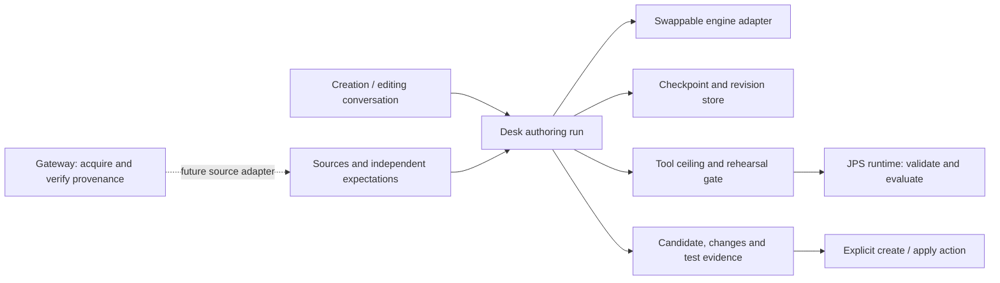

# Own the authoring run above the model adapter

A pack may need many draft, test and repair cycles. A single model response or a
green validation report cannot establish that its decisions match the intended
policy. Creation and later editing need the same revision and test machinery;
scheduled maintenance additionally needs a host that remains available after the
browser closes.

Keep the existing certified Vercel adapter behind the Desk engine contract.
Place a framework-independent controller above it, with explicit proposal,
check, review and checkpoint ports. The first proof is implemented in
`web/src/assistant/authoring`. It does not replace the production Create route.
See the [reproducible experiment](../experiments/2026-09-14-iterative-authoring/README.md).

## Responsibilities across the repositories

| Component | Responsibility | First milestone / remaining work |
| --- | --- | --- |
| JPS specification | Meaning of conditions, outcomes, missing facts and handoff | Consume Core 0.2.0-draft; no new authoring semantics |
| Runtime | Validate candidate bytes; evaluate facts and evidence; matrix comparisons and history profiling | Real inline validation and rehearsals exercised; bounded unsaved matrix API still needed |
| Gateway | Acquire external material and produce verifiable lineage under its separate identity and credential boundary | Integration contract below; no live acquisition or action in this proof |
| Desk | Conversation, source references, revision history, run budgets, proposals and review UI | Headless controller and fixture mocks; production conversation/store integration next |
| Execution host | Persist and resume jobs, enforce deadlines, handle triggers and deduplication | Browser-independent hosting decision required before background maintenance |

### Runtime contract

Use the runtime's served tool schemas and authoring prompts. The current proof
fetches `author_pack` and invokes `validate({document})` followed by
`experimental_evaluate({pack, facts, evidenceAvailability?, rehearsal:true})`.
Every call passes through the existing Desk transport gate. Invalid validation
reports remain diagnostics even when MCP marks them `isError`; transport and
evaluation failures stop the run instead of becoming policy disagreements.

The checker binds each result to exact candidate bytes and runtime identity. It
compares independently established expected dispositions with actual dispositions;
`status: evaluated` alone is never a passing case. The small proof comparator
compares JSON values, preserving array order; it is neither the full matrix
comparator nor an RFC 8785 canonicalizer.

The next runtime deliverable should be a bounded candidate-test capability,
designed in the runtime repository before adding it to Desk's tool ceiling:

- Input: candidate bytes, matrix bytes, explicit limits, and optionally an
  explicitly selected history/profile input. Accept no arbitrary filesystem path
  supplied by the model.
- Output: candidate and matrix digests, runtime/comparator version, validation
  diagnostics, every row's expected/actual comparison, and a complete, cancelled,
  failed or limited status. Partial execution must not look like a complete pass.
- Execution: unsaved candidate, rehearsal semantics, cancellation and bounded
  resource use, with no project save or operational decision record.
- Reuse the runtime's matrix comparator and profile implementation. Do not copy
  their semantics into frontend code.

This is a proposed contract, not an existing MCP tool name. At the inspected
runtime commit, `experimental_test_packs` selects configured saved packs; it does
not accept the unsaved candidate used here. `packs suggest` produces candidate
inputs, not authoritative expected answers. History profiling is a separate
comparison: a historical decision does not automatically establish correct policy.
See [tool definitions](https://github.com/Judgment-Pack/judgment-pack-runtime/blob/0c8a4b63a3868ce7a96d0ce012b59f7a5611f430/internal/mcp/tools.go),
[candidate inputs](https://github.com/Judgment-Pack/judgment-pack-runtime/blob/0c8a4b63a3868ce7a96d0ce012b59f7a5611f430/docs/adr/0024-suggest-candidate-row-inputs.md), and
[history profiles](https://github.com/Judgment-Pack/judgment-pack-runtime/blob/0c8a4b63a3868ce7a96d0ce012b59f7a5611f430/docs/adr/0034-profile-a-matrix-against-its-history.md).

### Gateway contract

Gateway integration is optional for a locally supplied policy. Keep an uploaded
reference distinct from externally acquired, verified material. A source record
should preserve its exact bytes/digest, title and excerpt locations, acquisition
identity/time when available, and separate receipt verification state.

For a gateway source, retain the receipt, session/call identity, key identity,
artifact digest and the material needed for the consumer's verification ceremony.
The consumer verifies a store it holds against its pinned key, resolves the
receipt/session registry as specified, binds the accepted receipt, and re-digests
the artifact before using it. A gateway's own `/verify` response is diagnostic
convenience, not that consumer boundary. Represent absent, unchecked, failed and
verified provenance distinctly; never promote a dropped PDF to verified provenance.
Receipt integrity does not establish the truth of its content.
See [Gateway SPEC §5a](https://github.com/Judgment-Pack/judgment-pack-gateway/blob/03582d9432a73d7d1f03f916e4ef58c7fc6c2773/SPEC.md)
and [consumer usage](https://github.com/Judgment-Pack/judgment-pack-gateway/blob/03582d9432a73d7d1f03f916e4ef58c7fc6c2773/README.md).

The inspected gateway mints version 3 receipts and now exposes `/act`. An authoring
or maintenance agent receives no `/act` tool. Live execution is a separate user
action through gateway authentication and its executor checks. A tested pack or a
`ready` proposal does not authorize an external write. The gateway executor itself
records request/response lineage; it does not establish that the action was right
or that a human approved that specific action. See the
[executor design](https://github.com/Judgment-Pack/judgment-pack-gateway/blob/03582d9432a73d7d1f03f916e4ef58c7fc6c2773/docs/design/executor.md).

## Run state and limits

The controller checkpoints after completed stages. A restart resumes from the
saved candidate/check stage, not a truncated model stream. Revisions retain their
failed results. Baseline changes stop stale editing; a changed runtime invalidates
the latest check. Every case has an expectation source; a reviewer may add cases
but cannot silently rewrite an established case to make the candidate pass.

The proof bounds candidate revisions and review passes, detects repeated candidates,
honors cancellation, and stops for policy questions. A production host must also
enforce elapsed time, token/cost and request budgets, retry/backoff rules and storage
limits. A higher iteration limit is not durable execution or an unlimited license
to keep optimizing. Unknown policy, exhausted budgets and unavailable infrastructure
need distinct visible outcomes.

Checkpoints in this milestone are trusted host state, not an import format. The
production store needs a versioned decoder, retention policy, concurrency control,
and revision comparison before applying a proposal. The proof uses atomic file
replacement and reload; it does not claim power-loss durability or process-crash
recovery during an external tool operation.

Reasoning effort and adversarial review are separate controls in the proposed UI.
The existing adapter's thinking/refutation behavior remains unchanged in this
milestone. A fresh reviewer receives candidate, policy sources and a rubric; it
does not need the author's private reasoning. Progress entries and test evidence
must be real run events; do not manufacture reasoning text for a thinking panel.

## Delivery sequence

1. **This milestone:** repeatable real-runtime proof, controller failure tests and
   viewable initial/drafting/review mocks. Keep the adapter swappable.
2. **Conversation and shared workspace:** implement ordinary chat/clarification
   events, source attachments and model capabilities; reuse conversation, composer,
   structured preview, changes and test components in Create and Edit. Use the
   existing AppShell pane/resizing machinery. The initial brief starts AI authoring;
   users inspect and request changes through chat, then explicitly create/apply.
   If Admin has no usable model, explain the setup requirement at the initial page.
3. **Runtime candidate matrix API:** implement and test the bounded contract above,
   then deliberately extend the Desk tool ceiling. Add independent expectations,
   missing-fact cases, boundary cases and held-out history evaluation.
4. **Optional gateway sources:** implement receipt/artifact retention, pinned-key
   consumer verification and source-to-rule references. Keep connector credentials
   and gateway authentication outside browser/model state.
5. **Background maintenance:** choose a durable execution host explicitly. Trigger
   on schedule, changed policy/data or new test results; deduplicate by pack baseline
   and input digests, reuse the same controller/checker, and produce an improvement
   recommendation with evidence. Do not automatically apply or publish a proposal.

Vercel remains the current model/tool-loop adapter, not the owner of product state.
The proposed conversation layer can use assistant-ui through an external-store
adapter; it is not installed by this proof. Background hosting requires revisiting
ADR-0001's browser-only placement deliberately, rather than introducing hidden
browser timers and calling them heartbeats.
