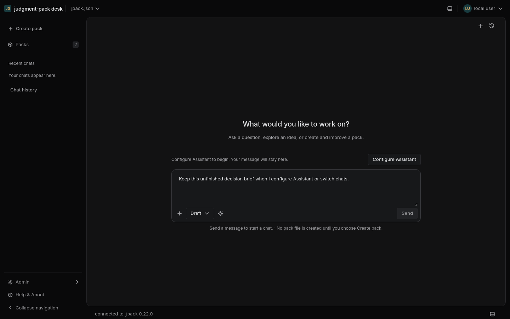
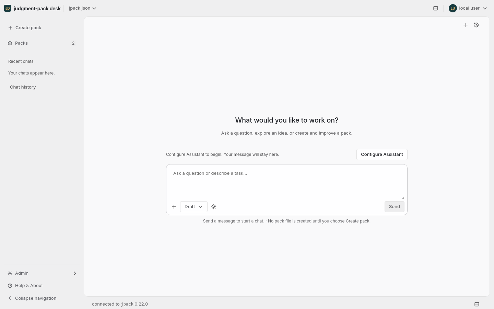
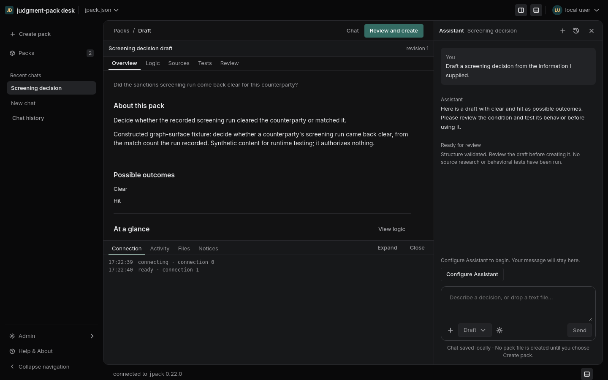
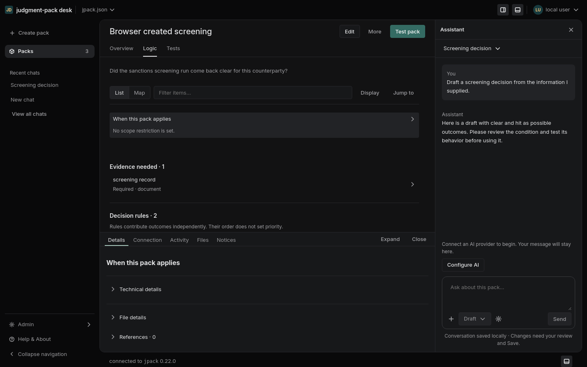
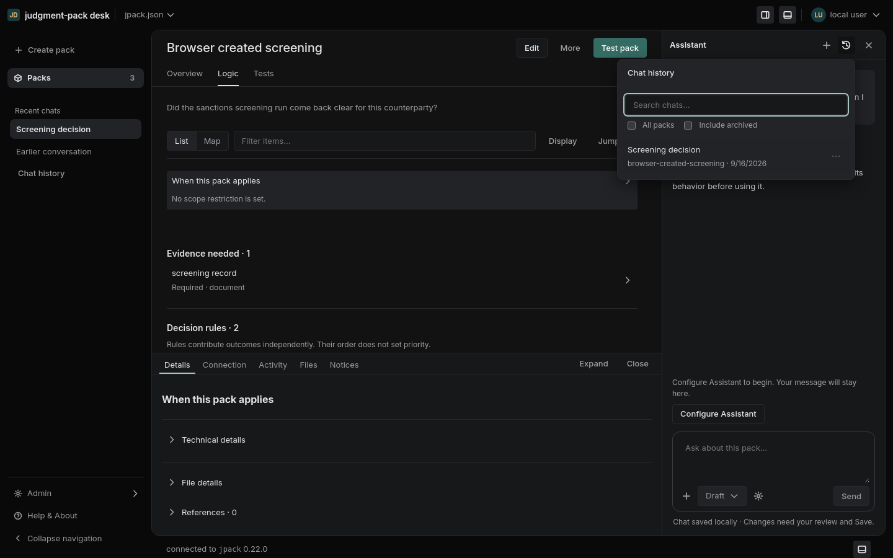
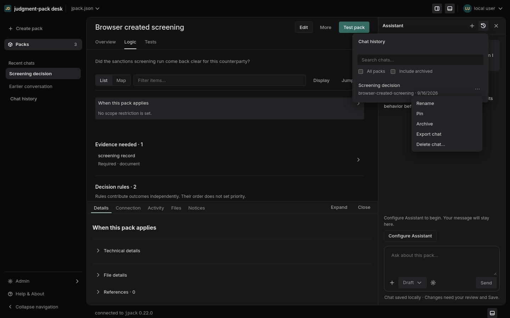
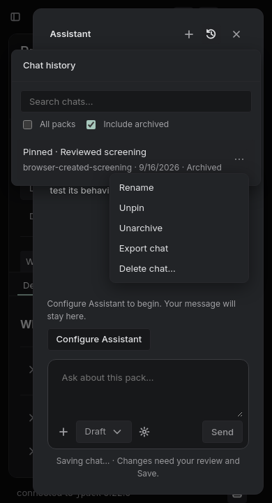
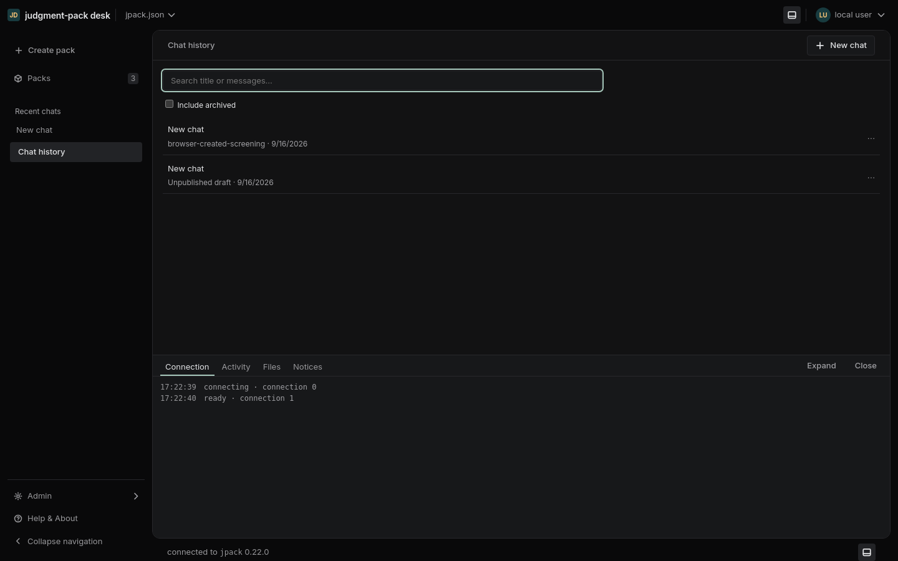
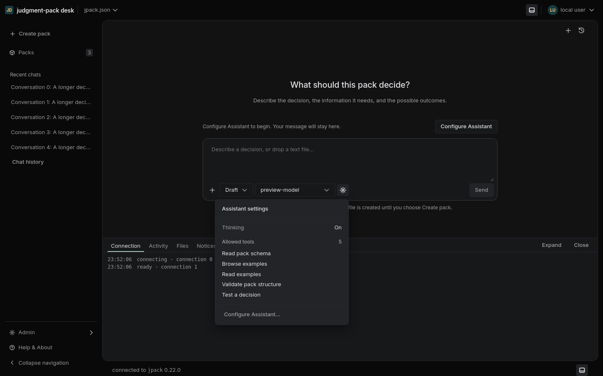
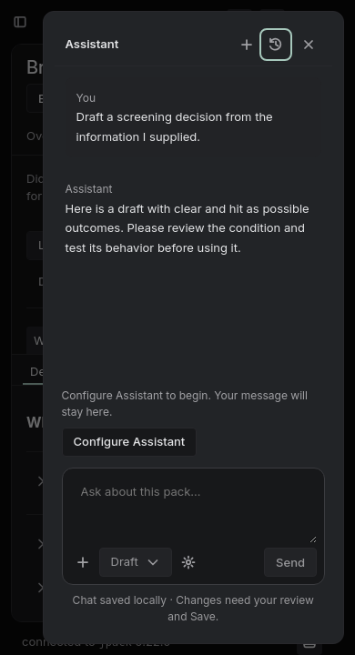

# Chat workspace

Status: chat workspace merged in #91; home and menu refinements follow in #99.
Storage and engine decisions are recorded in [ADR 0002](../adr/0002-project-conversations-and-chat-workspace.md).

The current Create page asks for metadata before the conversation, loses the run
on navigation, and makes the reader choose between details and the assistant.
The replacement starts with a single composer. Opening a draft docks the same
chat beside it; creating a pack links that chat to the saved pack.

## Regions and transitions

- Left: Create pack, Packs, then recent chats. Chat history opens the project history page.
- Main: conversation until the person chooses Open draft; then the draft, its
  sources, tests, and final review. Do not automatically move focus on generation.
- Right: Assistant on authoring and pack document routes. New chat and Chat history are icon buttons in the pane title bar.
  History opens in a bounded, nonmodal popover; the conversation stays mounted underneath. One pack may have multiple conversations.
- Bottom: selected details and Activity, underneath main only. The Assistant
  stays full height. Both dividers use the same accessible separator component.
- Narrow screens: explicit Chat/Draft navigation; no forced three-column layout.
- Missing configuration: retain the composer and explicitly open Configure Assistant using
  Admin's existing form. Include a link to the full Admin page.

Home stays at `/` and opens an unsubmitted composer. Merely visiting home,
reloading, typing or choosing New chat creates no saved conversation. The first
accepted Send promotes that draft into history, once. New chat from a pack retains the explicitly
shown pack context. Switching conversations restores the draft, text, model and
view. It never submits, cancels, or changes a running task. One active operation
per project in each window is allowed initially, with an explicit Stop action. The first send
names a chat; rename, pin, archive and delete affect history, never pack files.

## Persistence and trust

Conversation checkpoints live outside the project under the chassis' protected
local configuration directory. The API is authenticated and origin checked,
project scoped, size bounded, versioned and optimistic-concurrency checked.
Files are owner-only, opened without following links, and replaced atomically.
Completed conversation checkpoints never live in browser storage. An unsent home
composer is cached in sessionStorage for this tab and project, so reload does not
discard it. First Send or explicit New chat clears that cache. API keys remain
in the protected key store.

Persisted readiness, receipt verdicts, checks and approval tokens are not
authority. Restoring a checkpoint must make creation unavailable until sources
and expectations have been verified and the exact candidate rechecked. Reload
never starts paid work. Unsaved persistence failures remain visible and prevent
a false "saved" indication. Deleting a chat does not delete a pack or its
research record. Existing explicit expectation-approval and Create gates remain.

## Visual rules

Use existing tokens, Radix primitives and typography. Selection uses neutral
surfaces and unchanged text colors; green and gold are restrained semantic
accents. Keep headers and composers outside their scrolling content. Details
are supplemental, not a second copy of the main document. Controls describe
actions (Open draft, New chat, Create pack), and activity reports actual work.

## References

- Linear, [Behind the latest design refresh](https://linear.app/now/behind-the-latest-design-refresh): quieter navigation and compact consistent controls.
- Linear, [Linear Agent](https://linear.app/docs/linear-agent): persistent conversations, recent history and visible running state.
- WAI-ARIA, [Window Splitter](https://www.w3.org/WAI/ARIA/apg/patterns/windowsplitter/): focusable separators, range values and keyboard resizing.

These inform the design; they are not a claim to reproduce Linear's private
design system. Validation covers restore and session isolation, long text,
small viewports, keyboard resizing, configuration recovery and creation gates.

## Verification

- Web production build and component/engine regression suite.
- Native runtime replay of expectation admission and explicit correction.
- Go custody, authentication, origin, size, unsafe-file and stale-write tests.
- `scripts/chat-workspace-check.mjs`: isolated browser flow through setup,
  session switching/reload, header placement, nonmodal history and focus, fresh validation, draft logic, keyboard/pointer
  resizing, short/narrow windows, creation and retained conversation.
- `scripts/containment-check.sh`: the existing route/width/pane matrix, extended
  to include a real saved conversation. Main-chat routes have no second
  Assistant pane, so their valid configurations exercise the bottom panel only.

Browser checks use a copied runtime project, temporary private configuration,
and an owned server process. They do not call a model or change the running Desk.

The title-bar follow-up passes all 15 isolated browser scenarios, including
nonmodal history, context-preserving New chat and two-stage Escape in a drawer.
The initial workspace layout sweep exercised 508 configurations; 485 passed and 23 hit an
obsolete assertion that the right divider must end above the bottom panel.
The assertion now checks the full-height right pane, its matching divider,
and the bottom panel staying beneath main only. All 124 desktop configurations
were rerun and passed, including all 23 affected cases. The default gate still
runs all breakpoint widths; an optional scoped rerun explicitly labels its
limited coverage. The copied fixture remained unchanged.

## Screenshots

Real browser renders using an isolated fixture, without a model call:

## September 16 follow-up: naming and compact chat controls

The audit found two header rows for one Assistant, a title dropdown hiding New
chat, a modal history browser obscuring the pack, and setup called both AI and
Assistant. Sending without configuration also opened an unexpected setup modal.

| Meaning | UI label | Removed variants |
| --- | --- | --- |
| Feature and pane | Assistant | AI as the feature name |
| Provider setup action | Configure Assistant | Configure AI |
| Settings menu | Assistant settings | AI settings |
| User conversation | Chat / New chat / Chat history | Mixed session/conversation labels in controls |
| Legacy assisted creation choice | Draft with Assistant | Draft with AI |

Provider names, model IDs, engine contracts and runtime research-session terms
retain their technical meanings. No stored data or API was renamed.

New chat and Chat history share the existing title bar with Close. The landing
page has these icon actions without a breadcrumb or redundant New chat title. Both icons reuse the
16px glyph system, neutral button states and Radix tooltip primitive. The
main chat uses the same toolbar in its page header, without another divider.
The history popover is searchable, marks the current chat neutrally and retains
rename/pin/archive/export/delete. Pack history defaults to that pack; project
history has its own page. Returning from history preserves the composer and
conversation DOM. It uses a 24rem width constrained by viewport gutters and a
scrollable list below its search field. Assistant settings uses the same shared
Popover primitive at 20rem, with labeled Thinking and Allowed tools sections.
Escape returns to chat, including inside a narrow-screen
Assistant drawer; a menu retains its own Escape handling.

Setup appears only after an explicit Configure Assistant action. Its label and
form match Admin. Send remains disabled until configuration is available; an
unsent prompt stays editable. Closing setup restores focus to the actual opener.

References reviewed (these inform our adaptation, not an exact replica):

- [Linear's design refresh](https://linear.app/now/behind-the-latest-design-refresh):
  predictable action placement, restrained navigation and fewer separators.
- [Linear Agent](https://linear.app/docs/linear-agent): history is available from
  the agent toolbar, and chats retain context over time.
- [Claude Code in VS Code](https://code.claude.com/docs/en/vs-code): top-of-panel
  history, searchable previous conversations, and session rename/archive.
- [Codex IDE extension](https://learn.chatgpt.com/docs/codex/ide): keep chat and
  review beside the current work. The installed extension also declares a New
  Chat command and an icon-based New Agent action.

## Home lifecycle follow-up

The home route remains `/`; its current conversation is retained in browser
history state. Existing `/chats/:id` links still open saved conversations, and
`/create-pack` resolves to home. Draft promotion keeps the same live worker,
composer and run identity. A blocked Send never creates history. Opening a pack's
Assistant uses the same deferred creation rule. Empty legacy history entries are
hidden, without deleting stored records.

The isolated browser check now covers 20 scenarios, including zero history
writes across home visits, typing, setup, reload and repeated New chat actions.
Store regression tests cover first accepted Send, subsequent sends, restoring an
unsent draft and project isolation. The browser flow also checks popover width,
focus restoration, history actions and Escape inside the narrow Assistant drawer.

## Follow-up: available actions and nested menus

The landing invitation is “What would you like to work on?” with a neutral
question/task composer. Pack creation is one suggested task, while a conversation
inside an open pack retains explicit pack context. This follows the broad entry
point shown in [Linear Agent](https://linear.app/docs/linear-agent), rather than
asking everyone for pack metadata before a conversation.

New chat keeps a stable toolbar position but is disabled when both the composer
and conversation are empty. Whitespace does not enable it; draft text, messages
or a generated candidate do. The history row uses the shared 16px More icon
centered in its 28px control, with equal content and action gutters. Menus use a
shared layer above dialogs and popovers and below tooltips, so an action menu
opened inside history cannot lose its first item behind the parent. Radix still
handles viewport collisions, keyboard opening, focus restoration and Escape.
The actions tooltip is suppressed while its menu is open.

These are Desk adaptations of Linear’s [2026 design refresh](https://linear.app/now/behind-the-latest-design-refresh): predictable action placement, quieter
secondary controls and restrained borders. Linear’s public articles do not
specify a private token scale or require our exact disabled-button behavior.
Browser checks hit-test all nested menu items, verify icon centering, and cover
the same action menu inside the narrow Assistant drawer.

On narrow screens, a popover opened within the modal Assistant drawer joins
that existing modal stack. This is based on the trigger's owning surface, so
route-owned portals cannot cause a click inside history to dismiss the drawer.
Desktop history stays nonmodal. Escape dismisses actions, then history, then
the drawer, restoring focus at each level.
