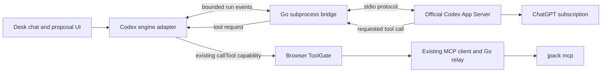

# ChatGPT subscription support in JPS Desk

Status: milestones 1–4 and managed runtime preparation are implemented locally. Protocol/account/run integration, shared configuration,
model discovery, setup UI and assistant consumers have local test coverage.
Real subscription sign-in and release validation remain unfinished.
Date: 2026-09-25.

## Outcome and scope

A local Desk user selects OpenAI / ChatGPT, connects an existing ChatGPT account
through Codex's official sign-in, and uses Desk's own chat and authoring surfaces
without obtaining a developer API key. Every run visibly identifies ChatGPT
subscription authentication and the Codex agent.

Preserve the React frontend, Go chassis, browser-owned MCP client, existing JPS
runtime, and user acceptance of proposals. Extend the existing assistant engine
slot and Go subprocess management. The new execution path is a bounded Codex
bridge; this plan introduces no OpenHands platform or general-purpose agent server.
The browser-only loop restriction in ADR-0001 needs a narrow, documented amendment:
Desk still owns the engine contract and tool mediation, while Codex runs its loop
in a managed local subprocess.

The first release targets local, single-owner Desk installations on hosts that
pass the capability checks. Desk prepares a pinned official Codex runtime on the
first explicit connection; an executable override is an advanced owner option.
Keep existing API configurations working without migration; they are compatibility
coverage, not the feature being developed. Remote hosting, Docker packaging,
Claude, Gemini, and shared terminal-login reuse follow
separately after the first subscription path is certified.

## Integration design



Tool results return along the same path. Codex receives host-provided tool
schemas and requests their execution; it never gets a direct JPS connection.
This preserves the actual browser ToolGate rather than duplicating JPS logic in
Go or introducing a new MCP server. Desk's existing host tools use the same
callback path and retain their own execution budgets.

Existing model endpoint runs continue through the Vercel adapter and model relay.
There is no subscription-to-API translation layer. The chosen engine is explicit;
a subscription failure ends the run instead of selecting another engine.

## Evidence and first unresolved boundary

The installed CLI reports `codex-cli 0.145.0`. Its experimental JSON Schema was
generated into `/tmp/jps-codex-plan-schema` without starting an agent or reading
credentials. It includes thread/turn creation, ephemeral threads, host-provided
function tools, tool call identifiers, ChatGPT browser/device login, account
status, and refresh requests. This version is a candidate for certification,
not yet a supported Desk dependency. Its schema also marks externally supplied
ChatGPT tokens as internal/unstable; this integration will not use that mechanism.

[Codex App Server](https://learn.chatgpt.com/docs/app-server) is the official
embedded-client protocol. Its dynamic tool callbacks are experimental, so the
bridge must be tested against an exact supported CLI/protocol version.
[Codex authentication](https://learn.chatgpt.com/docs/auth) delegates credential
storage and refresh to Codex and supports restricting the login method.
[The configuration reference](https://learn.chatgpt.com/docs/config-file/config-reference)
documents tool and integration controls; individual toggles are not, by
themselves, proof that all independent tools are disabled.

The local proof now demonstrates host-tool callbacks and rejects attempts to
invoke native file writes, private-image reads, shell execution, web tools, and
subagents when both thread and turn specify `environments: []`. The original
read-only-only approach fails the tool-inventory check. The installed version
also rejects the previously documented `tools.view_image` configuration key.

There is one explicit qualification to “only Desk-supplied tools”: this version
always retains `update_plan` and, without an environment, `skills.list/read`.
Planning only emits native progress. With apps and all other integrations
turned off, the orchestrator skills catalog is empty and forged resource reads
are refused. These fixed utilities are included in the probe's inventory; they
are not JPS capabilities and do not get access to the browser MCP connection.
Any future integration must retain this exact restricted configuration and
retest the inventory, rather than assuming a read-only sandbox removes tools.

The bridge contract, Linux process lifecycle, private profile manager and account
lifecycle are implemented in `internal/codexbridge`. Session-guarded account
routes and the selectable engine use a lazily acquired private profile and
automatic verified runtime preparation. `--codex` remains an advanced override. The [setup record](codex-subscription-setup.md) describes activation and the
remaining authenticated release checks. The [account lifecycle record](codex-account-lifecycle.md) describes
the closed account routes, cancellation and restart recovery. The
[run bridge record](codex-run-bridge.md) describes the implemented transport,
browser candidate, budgets and verification limits. The
[proof report](../reviews/codex-subscription-proof.md) records the isolation
evidence, the native-utility qualification, and the remaining release gates.

## Concrete decisions

### Configuration and engine contract

- Add `codex` as a certified engine only after its conformance tests pass.
- Extend the strict Go and TypeScript decoders with a credential-free agent
  configuration. Proposed shape:

  ```json
  {
    "assistant": {
      "engine": "codex",
      "agent": {
        "provider": "openai",
        "authMethod": "subscription",
        "model": null,
        "tools": ["get_schema", "list_examples", "get_example", "validate"]
      },
      "thinking": "off"
    }
  }
  ```

- A null model is a saved but not yet runnable selection. Populate choices from
  the authenticated provider's model listing; let the user select one explicitly.
  The provider's real capability determines which reasoning tiers are offered.
- Existing `assistant.endpoint` may remain stored while Codex is selected, but
  it is inactive. Switching back requires an explicit selection. Unknown or
  inconsistent engine/provider/auth combinations refuse configuration.
- Existing files with no new members decode exactly as before. Use shared JSON
  fixtures to hold acceptance and decoded-value parity across Go and TypeScript.
- Resolve configuration into a discriminated target: model endpoint or provider
  agent. Consumers use one readiness abstraction. Subscription readiness never
  depends on whether an API key is saved.
- Keep common `AssistantSession` fields for prompts, tools, `callTool`, host
  tools, language, cancellation, and output events. Give the model branch its
  existing model-call capability and the agent branch a bounded agent-run
  capability. Do not invent a fake model endpoint for Codex.
- Adapt all assistant consumers, including chat, pack proposals, research,
  briefs, and test design. Unsupported capabilities must be explicit.

### Credentials and account lifecycle

- Use a Desk-owned Codex profile outside every project, configured through
  Codex's supported home/storage settings. Codex writes and refreshes its own
  credentials; Desk never parses, imports, copies, or returns OAuth tokens.
- Owner-only storage and a process lease protect the profile. Do not run
  competing login/refresh writers. Codex working directories are separate,
  empty, private scratch directories, not projects or credential directories.
- Use the native account methods for login, cancel, status, refresh, and logout.
  Browser and device-code choices depend on the supported host capabilities.
  Account presence alone is not proof of current entitlement or model access.
- Return only a closed status record: provider, auth method, agent, runtime
  availability, account state, last verification, and safely exposed plan label.
  Omit email/account identifiers unless a later account-switching UX needs them.
- Separate account states from run failures: a revoked login needs reconnect;
  a rate limit or temporary outage does not erase credentials or change billing.
- Keep login URL/device challenge only in the initiating page's transient memory.
  Validate returned authentication URLs against the pinned client's documented
  origins. Bound and cancel attempts; ignore stale completions after disconnect.
- Require ChatGPT auth for this profile and strip conflicting credential and
  provider overrides from the subprocess environment. Verify the actual account
  type before starting a turn. Refuse API-key, external-token, or other-provider
  account types. Do not purchase credits or change spending settings.
- Disconnect first stops new runs, cancels pending login and active turns, and
  performs official logout for the Desk-owned profile. Describe local sign-out
  accurately; do not claim account-wide token revocation unless Codex provides it.
- Standard terminal credentials are untouched. Existing terminal-login detection
  and reuse remain a later capability: enable only if official mechanisms can
  preserve both credential ownership and isolation from unrelated configuration.

### Go bridge and transport

- Start the trusted `codex app-server` executable over stdio using a fixed
  argument list. No shell command strings or browser-supplied executable paths.
  Resolve the executable outside project configuration, following Desk's existing
  trusted companion pattern; report absent/unsupported versions as unavailable.
- One supervised App Server per Desk-owned provider profile, with a serialized
  auth lifecycle and bounded run concurrency. Begin with one active run for the
  initial release; additional requests receive a clear busy result.
- Keep the process alive while it owns login or run work; stop/reap it on Desk
  shutdown. Use a private installation lease to prevent two Desk processes from
  owning the same profile. Release the lease after process cleanup.
- Add session-guarded provider catalog, status, login, login-cancel, and logout
  routes under `/api/model-providers`. Add one authenticated duplex run channel
  using existing WebSocket/session/origin conventions.
- The run channel carries Desk-defined start, output, tool-request, tool-result,
  cancel, and terminal messages. It is not a raw App Server RPC proxy. Go admits
  only the required upstream methods and constructs sandbox/configuration fields.
- Bind each run and outstanding tool request to its Desk session, thread, turn,
  and call ID. Reject unsolicited, duplicate, expired, or cross-session replies.
  Apply message-size, outstanding-call, output-buffer, and deadline limits.
- Cancellation releases outstanding callbacks and stops/reaps the native child.
  The candidate immediately tears down its process group, including blocked
  native stdin, rather than relying on graceful turn interruption. The browser
  assistant lifecycle retains MCP connection ownership. Desk logout, session
  expiry, policy changes, and socket loss also cancel. Emit one terminal outcome
  to a live consumer; never automatically replay a paid/model turn.
- Project/runtime children receive only the environment they need. A provider
  credential must never reach `jpack`, gateway companions, or model-visible tools.
  Apply the same rule to inherited descriptors and scratch paths.
- Disable agent telemetry and extra history for this profile where supported.
  Use ephemeral run threads and verify what the pinned client still retains.
  Desk remains the conversation store. Never blindly forward stderr, raw protocol
  frames, or upstream error bodies into logs or browser errors.

### Tool and proposal handling

- Discover real tool schemas using the existing assistant MCP connection.
  Register only the configured allow-list intersected with Desk's ceiling.
  Map JPS and host tools into separate names if needed; reject collisions.
- Execute every runtime tool callback through the existing `callTool` capability.
  Retain `experimental_evaluate` rehearsal rewriting in ToolGate and its ordering
  relative to tool-call and tool-result presentation.
- Route host tools through their existing implementations, signals, budgets, and
  source/evidence checks. Do not replace them with Codex's native web tools.
- Reuse Desk's authored system prompts, language instructions, proposal parsing,
  canonicalization, validation, critique recording, and acceptance workflow.
  Extract genuinely shared orchestration from the Vercel loop where needed.
- Apply turn/tool/time/output budgets to the external loop. Keep reasoning effort
  distinct from adversarial review, and show unavailable reasoning explicitly.
- Run the critique using the same constrained runtime and tool capabilities.
  A provider-authored claim of success cannot substitute for runtime checks.
- Disable the native execution environment at both thread and turn creation.
  Permit only the fixed native utilities recorded in the proof, with no
  orchestrator catalog or ambient integrations. Keep a restricted named
  permissions profile and no write/escalation permissions as a second layer. Unknown permission requests are refused, never auto-approved.
- A tool request that cannot be represented safely fails visibly. No direct MCP,
  raw runtime, shell, file-write, or API-key fallback is allowed.

### Setup experience

Admin > Assistant offers OpenAI / ChatGPT with a ChatGPT subscription choice.
The first-time flow is:

1. Check compatible Codex installation and host capabilities.
2. Connect ChatGPT using the official browser flow or device-code flow.
3. Show connection status; retrieve available models and choose one.
4. Save the explicit provider/auth/agent/model selection.
5. Offer a user-initiated test that performs a real bounded JPS tool run.

Connected UI reads “Connected to ChatGPT”, “Authentication: Subscription”,
“Agent: Codex”, and the selected model. Provide Reconnect and Disconnect, plus
clear states for missing CLI, unsupported version, pending login, expired login,
provider unavailable, subscription limits, and no selected model. Selecting
subscription never displays an API-key input. Use the existing localization and
settings components. A configuration change cannot retarget an in-flight run.

The provider catalog owns available methods and capabilities. React renders it;
provider conditionals and CLI/auth behavior stay outside individual controls.
Claude and Gemini are not shown as working subscription connections until their
own adapters and supported authentication paths are certified.

## Delivery sequence and acceptance

| Milestone | Deliverable | Required evidence |
| --- | --- | --- |
| 1. Protocol and isolation proof | Exact CLI/schema candidate; minimal private-profile harness; ADR-0001 amendment draft | Host tool round-trip; no ambient tools or credential exposure; subscription-only auth; sandbox refusal when unavailable |
| 2. Process and account integration | Supervisor, sanitized auth routes, login/cancel/logout lifecycle | Scripted native-protocol tests for success, failure, expiry, refresh, stale callbacks, session revocation, and cleanup |
| 3. Engine and JPS integration | Codex adapter, bounded duplex capability, existing ToolGate callbacks, proposal/critique reuse | Full common engine conformance, real JPS schemas/results, no writes/audit records on rehearsal, deterministic cancellation |
| 4. Configuration and setup UI | Shared decoder fixtures, resolved target/readiness, provider catalog, subscription setup | No API key required; explicit engine/method; successful save/reload; preserved legacy configuration; localized accessible status |
| 5. Release validation | Certified version/capability check, installation guide, live subscription smoke evidence | Full existing suites plus authenticated Desk-to-Codex-to-JPS run on each supported host; no hidden fallback |

The proof and bounded run contract preceded the UI. The integrated UI can now
execute a constrained session and remains behind an explicit experimental
installation flag. General release still requires the authenticated validation
in milestone 5; local scripted tests do not establish account entitlement.

## Expected file areas

| Area | Existing integration points | New modules, names provisional |
| --- | --- | --- |
| Backend | `main.go`, `internal/desk/server.go`, session cancellation and runtime child constructors | `model_providers.go`, `codex_process.go`, `codex_protocol.go`, `codex_auth.go`, `agent_relay.go` and tests |
| Configuration | `internal/desk/deskfile.go`, `web/src/config/deskConfig.ts`, shared fixture corpus | Provider/agent target types and fixture cases |
| Engine | `assistant/engine.ts`, `session.ts`, `engines/index.ts`, `useAssistantSlot.ts`, `useAssistantRun.ts`, research/chat/proposal consumers | `assistant/engines/codex/`, bounded agent capability, scripted protocol fixtures |
| UX | `assistant/EndpointForm.tsx`, `AssistantSection.tsx`, model picker, settings hooks, locale files | Provider catalog client and subscription connection control |
| Documentation | ADR-0001, setup documentation, prior feasibility review | Version/capability contract, login guide, test evidence and limitations |

Work around the substantial pre-existing changes in these files; do not reset or
reformat unrelated work. JPS runtime semantics and pack formats need no changes.

## Test matrix

- Auth: absent login; existing login in the Desk-owned profile after restart;
  browser and device flow; cancelled/expired challenge; concurrent/stale login;
  refresh success/failure; revoked account; disconnect during login and turn;
  wrong account type; missing entitlement; subscription-limit and outage states.
- Billing isolation: API keys, alternate endpoints/providers, proxy overrides,
  existing terminal profiles, plugins, and MCP definitions present on the host
  cannot change this run's selected subscription provider or tool surface.
- Transport: malformed/oversized frames, out-of-order output, cross-run IDs,
  duplicate tool replies, disconnect, startup timeout, blocked tool callback,
  subprocess crash, and process-tree cleanup. No automatic turn retries.
- JPS: actual `tools/list` schemas and an allowed tool call; denied tool attempt;
  evaluation with rehearsal forced; unchanged project/audit tree until user
  acceptance; complete host-tool/evidence and proposal/critique behavior.
- Secrets: sentinel credentials absent from frontend responses/storage, pack
  files, exports, chat backups, logs, prompts, tool results, child environments,
  and model-visible filesystem access. Check both success and error paths.
- Compatibility: existing API configs and keys unchanged; Go/TypeScript fixture
  parity; every assistant consumer handles agent targets; switching requires an
  explicit action and does not alter an active run.
- Run Go tests and vet, TypeScript checking, localization checks, production
  build, browser tests, common engine conformance, and applicable containment
  and mutation checks. Do not run formatters over unrelated dirty files.
- Live release smoke: from Desk, connect an account, select a model, prompt for
  a bounded schema/validation task, observe the actual gated JPS tool result,
  accept/reject a proposal, cancel a turn, restart Desk, and disconnect.
  Missing credentials mean “not tested”, never a passed smoke check.

The previous assessment recorded passing baseline Go tests and 340 targeted
assistant tests. Subsequent local implementation and verification are recorded
in the account lifecycle and run bridge records above. New run behavior has
scripted protocol and recorded JPS coverage; live subscription access remains
untested. The candidate is now in the registry, with model and agent transport matrices
covering their respective capabilities. General release remains subject to the
authenticated checks above.

## Follow-on scope

After ChatGPT is proven, add provider adapters one at a time. Claude must use an
allowed official runtime/hosting arrangement with the user's own sign-in;
Gemini must distinguish a Google account from a paid plan. Require the same
host-tool mediation and conformance for each. Keep those integrations independent
of JPS and avoid introducing OpenHands solely to obtain authentication.

Existing-terminal-login reuse needs a supported credential-sharing mechanism
that does not import arbitrary provider settings or copy tokens. Docker needs
an explicit persistent private credential volume, device-login support, process
and sandbox validation, and platform-specific test evidence. Hosted multi-user
identity/isolation is a separate Desk architecture milestone.
