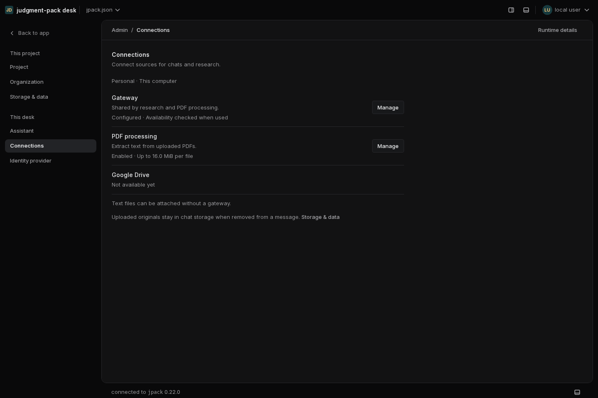
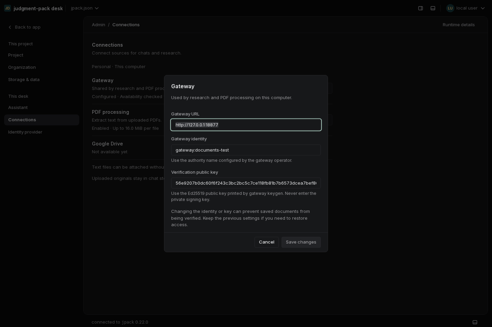
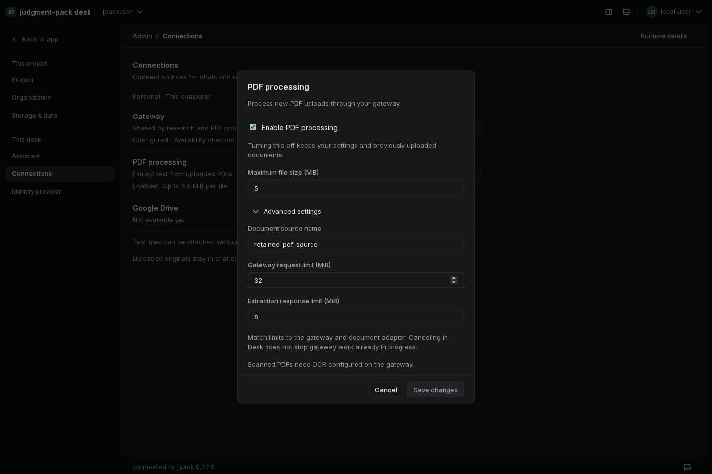
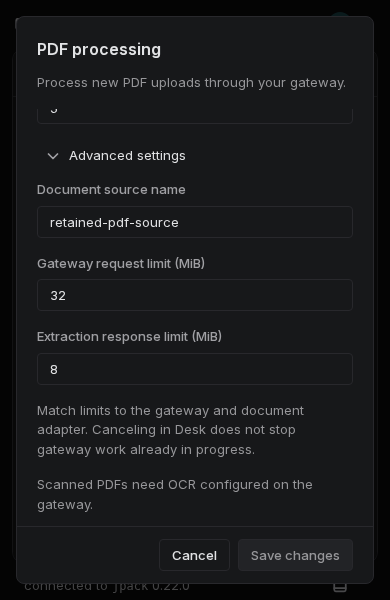
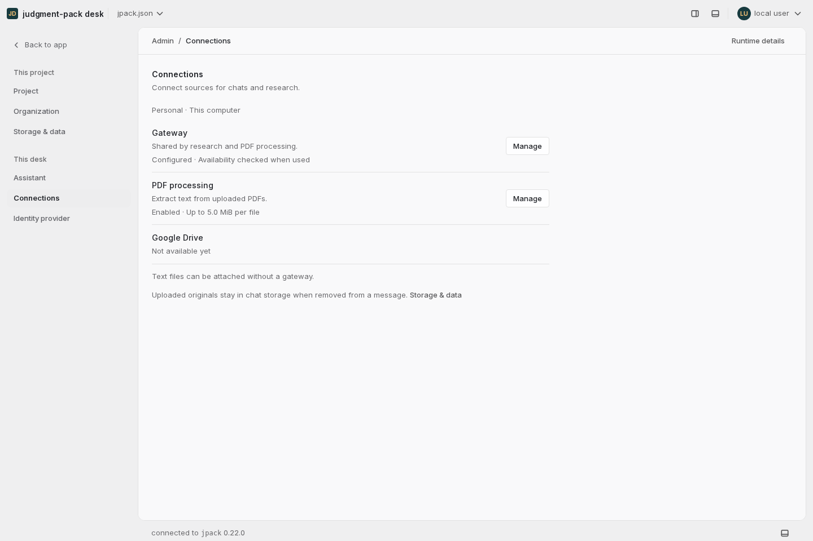

# Connections settings review

The Documents form is now **Admin → Connections**: a compact personal-settings
summary with separate Gateway and PDF processing dialogs. Google Drive remains
explicitly unavailable. Existing `/admin#documents` links open Connections.

The layout follows the quieter navigation, compact controls and reduced visual
weight described in [Linear's design refresh](https://linear.app/now/behind-the-latest-design-refresh)
and the summary-to-settings pattern in the
[personalized sidebar update](https://linear.app/changelog/2024-12-18-personalized-sidebar).
It uses Desk's existing typography, neutral surfaces and spacing tokens.

## Behavior

- Gateway configuration is shared with Research. Saving it does not enable PDF
  processing or claim that the connection was tested.
- PDF processing has an explicit enabled state. Disabling retains its source and
  byte limits; older configurations without that member remain enabled.
- New PDF uploads and the enlarged relay allowance are disabled on the server
  as well as in the browser. Saved originals remain available for verification.
- Conditional writes preserve sibling research settings. A conflicting save
  retains the draft; explicit reload reads the new revision before reseeding.
- Limits are displayed in MiB, retaining exact byte values. Advanced settings
  expand when a validation error needs attention.
- Reusable setting rows and an opt-in fixed Dialog footer keep Save/Cancel
  accessible while the body scrolls. Cancel/Escape protect dirty changes and
  restore focus to the opener.
- Retention guidance links to Storage & data, where the full explanation lives.
  These personal settings do not claim to enforce organization access policy.

## Validation

- Go suite passed, including shared config fixtures and disabled/re-enabled
  upload and relay bounds.
- Web suite initially found an obsolete error-message assertion and a CSS
  token-convention violation; both were corrected and their suites passed.
- Configuration and dialog tests cover defaults, explicit false, invalid
  enabled values, save conflicts, reload revisions, retained custom settings,
  separate gateway setup and discard/focus behavior.
- All 2,070 English messages have complete catalogs in the 11 additional locales.
- Chromium: 1440×960 and 390×600; dark and light; all 12 locales; legacy link;
  disable → save → reload → enable; focus restoration; fixed action footer.
  No page errors or horizontal overflow. No live AI or provider requests.

The repository containment gate was updated for the current `/` landing page,
`/chats` route and chat-only pane availability. Both XDG configuration and data
locations are isolated in its temporary fixture.

## Screenshots

