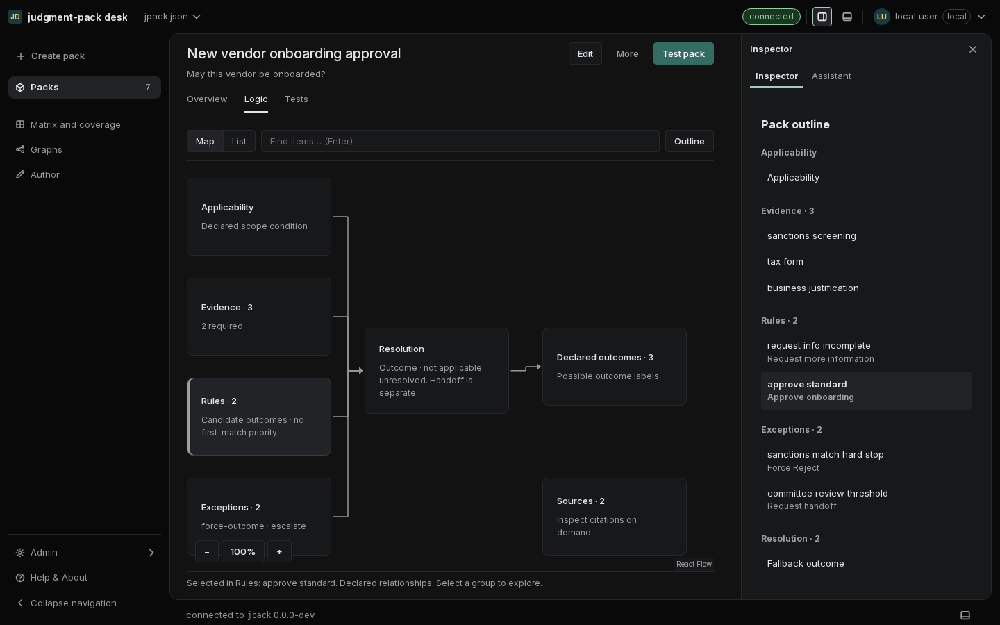
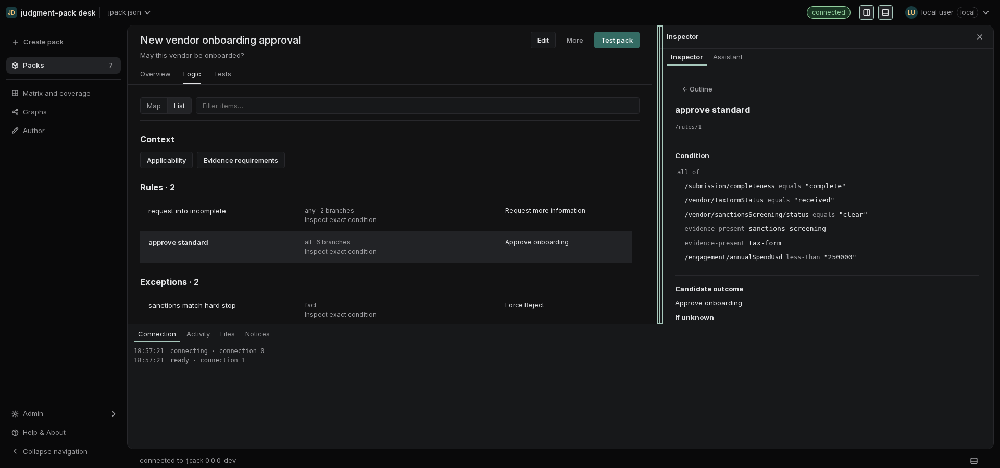
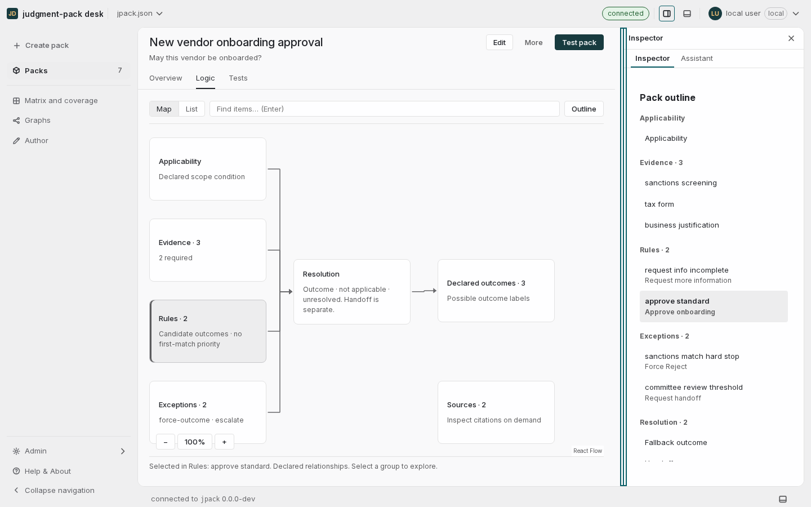
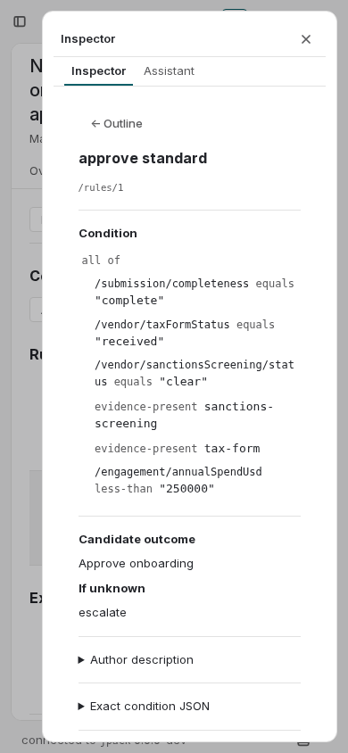

# Inspector spacing and resize review

September 12, 2026. Based on main `aa8463c`.

The Inspector previously met the browser edge and had a fixed width. The
workspace now keeps a 12px right gutter in both densities. The inset drawer
also keeps 12px above, below and to its right. The shared frame continues to
own the rounded boundary for main, Inspector and console.

## Width policy

| Setting | Behavior |
| --- | --- |
| Default | 360px, or the project's declared default within the current bounds |
| Minimum | 320px |
| Maximum | The smallest of 640px, 45% of workspace width, and the space left after the main working-width floor |
| Main working width | At least 480px; List requests 34rem; Map requests 49rem including gutters and scrollbar room |
| Too little room for both panes | Inspector becomes a drawer, with no resize divider |
| Stored preference | Per project and browser; temporary viewport clamps never overwrite it |

At normal text size, a 1440px window with the expanded rail gives Map a
398px Inspector maximum and leaves 784px for main. At 1920px, the Inspector
can reach 640px. At 1280px, Map uses a drawer; List still has room to dock.

## Interaction and reuse

`PaneDivider` is a shared vertical separator with pointer capture and a 12px
hit area. Its visible line stays neutral on hover and uses the shared focus
color for keyboard focus. Left/Right move 8px, Shift moves 32px, Home/End reach
the current bounds, Enter closes the Inspector and returns focus to its toggle,
and double-click or Escape resets its width. The hit area ends above the
console, including when the console opens during a resize.

The main route stays mounted. Resizing keeps the selected item, map viewport,
and unsent inputs. A viewport change can clamp the rendered width or change
the Inspector to a drawer without saving that temporary size. Existing v1
collapse preferences remain readable; an interaction writes v2 with only the
explicit choices. Reset panes clears the width too; resetting the divider
leaves other pane preferences intact.

## Verification

- Production build passed.
- 121 web test files / 2,993 tests passed, including width bounds, keyboard
  movement, preference migration, project isolation and reset behavior.
- 144 browser layout states passed: dark/light, comfortable/compact,
  1100/1280/1440/1920px, Map/List, console open/closed, and each applicable
  default/minimum/maximum width.
- 20 browser interaction checks passed: dragging past both limits, keyboard
  steps and bounds, reset, close/focus restoration, reload persistence,
  laptop clamping, restoring the saved size on a larger screen, changing
  viewport during a drag, 390px drawer, 200% text, 640×450 viewport, and
  retaining unsent test inputs, touch dragging and cancellation, lost pointer
  capture, and blocked browser storage. The 144-state sweep raised no page
  JavaScript errors.
- The expanded application containment gate samples 480 configurations,
  including Logic, frame/drawer insets and divider height above the console.
  Its final run result is recorded in [PR #62](https://github.com/Judgment-Pack/judgment-pack-desk/pull/62).

The [measurement summary](inspector-resize-verification.json) records the
144 layouts and 20 interactions individually.

The sweep caught and fixed two edge cases: an absolutely positioned divider
whose implicit grid end extended across the console, and insufficient map
working width after accounting for its scrollbar. These captures and the
144-state results include both corrections. Coverage is Chromium; it is not a
cross-browser accessibility certification. The build retains the existing
large-chunk warning.

## Browser captures

