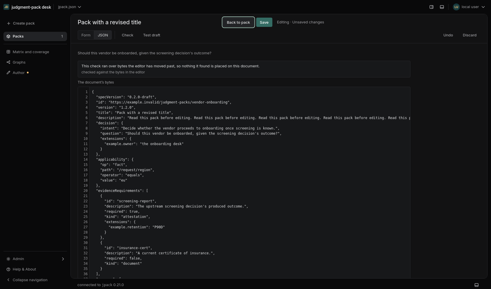
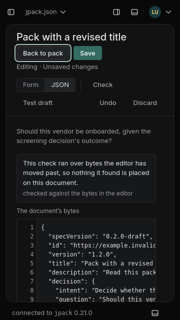
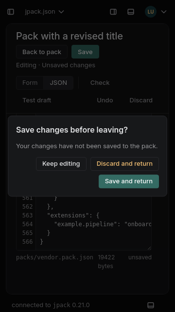

# Pack view and edit transition

Reviewed against the production route and Linear's public documentation on
2026-09-14. The linked screenshots are browser captures of this implementation.

## Findings and changes

| Finding | Result |
| --- | --- |
| Edit retained the reading scroll position, but Save and Read were inside the scrolling body. | The shared page header now holds Back to pack, Save, status and the secondary editing toolbar outside the scroll region. |
| Read was presented as an alternative radio mode, with no clear completion or cancellation flow. | Back to pack restores the previous reading section and selection. Unsaved work opens Keep editing / Discard and return / Save and return. |
| The saved-pack Test pack action remained primary beside a separate Try it draft action. | Save is the primary edit action. Test draft opens the inline draft testing surface. Saved-pack links return in reading mode. |
| A status dot conveyed dirty state, while write failures and verification were farther down the document. | A persistent text status distinguishes unsaved work, saving, success, conflict and unverified/failed writes. Detailed diagnostics remain in the document. |
| Edit moved into More on narrow screens; action widths could squeeze the title. | Edit remains visible. The shared title header wraps actions onto another row when its available width requires it. |
| Leaving an edit could hide unfinished operands that were not part of the JSON bytes. | The return dialog protects that work and explains why Save and return is unavailable until those fields are finished or discarded. Ordinary Save still writes the completed byte buffer. |

Save and return checks the actual read-back, buffer identity and any newer edits.
A failed/conflicting write or a changed draft remains open. No validation result
is used to prohibit saving invalid draft bytes. Existing pathname/close guards,
optimistic file concurrency and per-field undo remain in place.

## Linear references and Desk decisions

Linear's [March 2026 design refresh](https://linear.app/now/behind-the-latest-design-refresh)
identifies unpredictable header actions as a source of friction. It emphasizes
task hierarchy, quieter navigation, reduced icon decoration and softer/fewer
dividers. Desk applies these principles with stable header actions, quiet
secondary commands, neutral selected controls and its existing spacing/color
tokens. One primary Save button is our application of that hierarchy, not a
claim that Linear publishes this exact component specification.

Linear supports [inline title and description editing](https://linear.app/docs/editing-issues)
and description history. Desk retains the same pack route and draft buffer while
switching modes. It restores the prior reading context instead of sending users
to an unrelated authoring page. This change does not add persistent draft recovery
or Linear's description-history feature.

Linear's [comment documentation](https://linear.app/docs/comment-on-issues)
explicitly distinguishes automatically saved issue descriptions from comments
that must be submitted or saved after editing. Therefore there is no single
universal Linear saving interaction to copy. Desk retains explicit file saves
and read-back confirmation; adopting autosave would require a separate decision
about draft storage, file conflicts and recovery.

Linear's [issue creation documentation](https://linear.app/docs/creating-issues)
describes temporary drafts when navigating elsewhere and a draft-saving prompt
when closing creation. Desk's unsaved exit prompt follows the principle of
protecting work while accurately offering the persistence options Desk has.
It does not label an in-memory buffer as a persistent saved draft.

Linear's [editor documentation](https://linear.app/docs/editor) retains native
editing shortcuts and exposes contextual formatting controls. Desk preserves
field-level undo and its existing Ctrl/Cmd+S; keyboard focus moves to the visible
return action on entry and to Edit after returning. Escape dismisses the exit
dialog without discarding work.

## Verification

- 3,102 component tests passed, including eight new transition cases covering
  save/read-back, late edits, failure/conflict, unfinished fields and focus.
- Production typecheck/build passed.
- The [browser check](../../scripts/edit-transition-check.mjs) uses disposable
  project/configuration directories and an actual Desk chassis/runtime. It
  exercises scrolling, light/dark, both densities, widths from 360–1700px,
  Inspector resize limits, draft-pane dismissal, discard without writes, and a
  verified file save followed by return.
- [Browser results](pack-edit-transition/verification.json).

