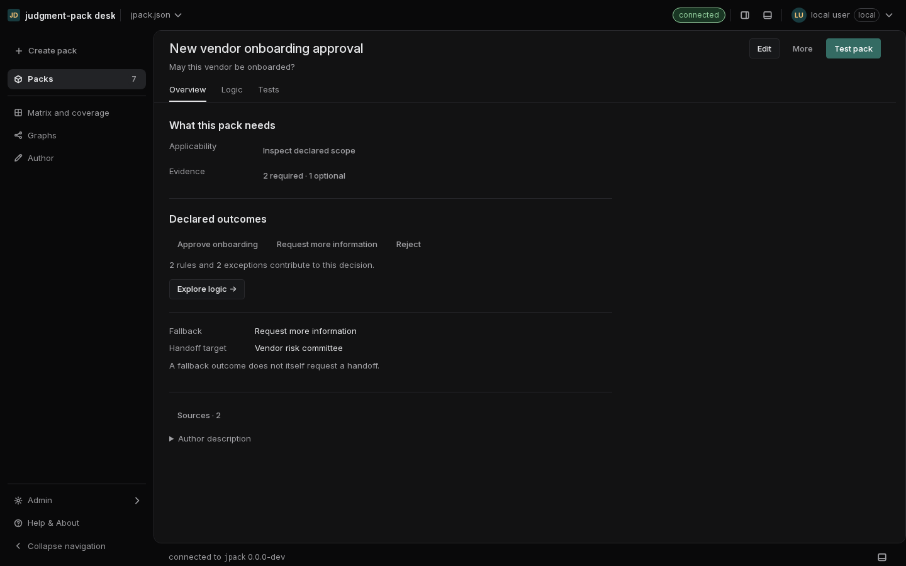
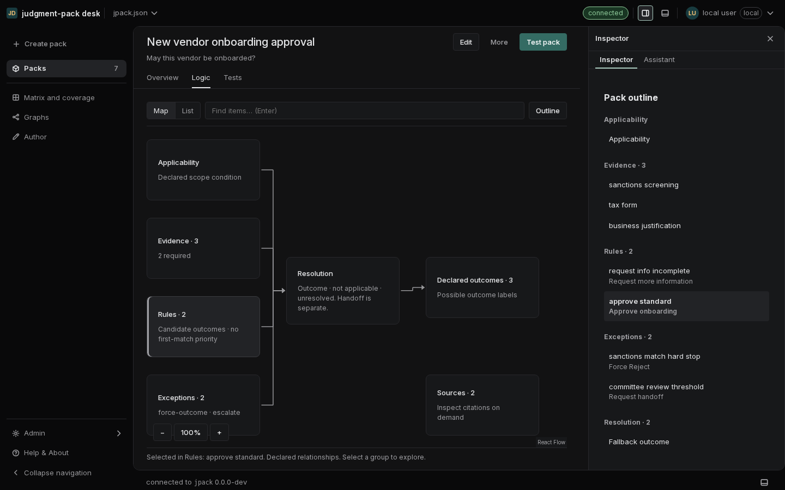
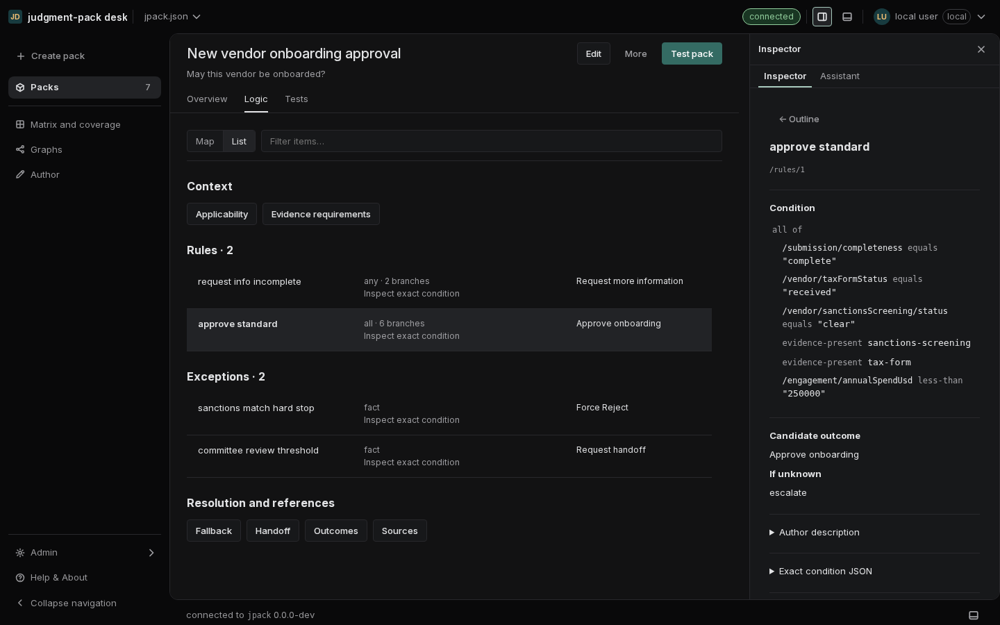
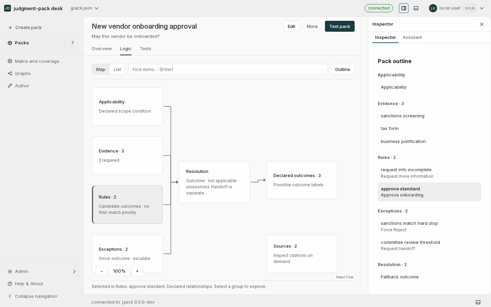
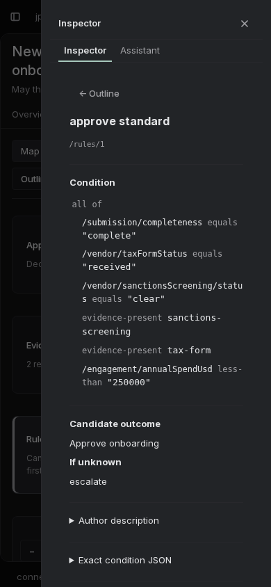

# Compact pack workspace review

Implemented against main `5609410`, September 12, 2026.

The reading page previously exposed several competing document sections and
repeated the pack title and question. It now opens with a short Overview and
one compact header. Logic offers interchangeable Map and List representations;
Tests remains the place to submit inputs and read outcomes.

## Layout and reuse

- The shared `PageHeader` gains a title variant: 20px title, 13px question,
  existing control heights and density gutters, and one full-width divider.
  Metadata and successful validation details move under More. Material
  validation problems remain visible.
- `RelationshipMap` is a lazy-loaded, read-only React Flow adapter. `logicModel`
  supplies the same original document values and pointers to the map, list,
  outline and inspector. Grouping keeps an 80-rule fixture at seven nodes.
- Map and List share selection, query and route-owned state. The shell keeps
  one right pane for Outline, exact definitions or the existing assistant.
  The existing bottom Activity channel records evaluation milestones.
- The inspector becomes a drawer when docking would leave too little main
  working width. It preserves selection and returns keyboard focus to the
  opening control. Closing the inspector and switching representations keeps
  it closed. Typing a map search only opens Outline when submitted.
- Exact nested conditions reuse the existing `ConditionTree`, with wrapping
  for narrow inspection. Author descriptions, raw JSON and advanced checks
  remain separate disclosures. Existing full-document and editing paths stay
  available.

## Color and typography audit

New feature styles and SVG definitions use the existing semantic tokens.
Page, cards, borders, connectors, selected backgrounds and selected labels are
neutral. Primary actions and keyboard focus use the existing green accent;
gold remains available through the existing status and identity tokens.
No feature palette, font family or new surface color was introduced.

React Flow's built-in group styling is avoided with a custom node type, which
preserves the shared neutral border and radius. Connectors route around cards.
The canvas retains native 13px node labels at its initial 100% zoom and does not
automatically shrink when the inspector opens. Text enlargement is independent
of explicit canvas zoom. The main frame retains ownership of rounded clipping.

## Runtime interpretation

The map shows declared relationships within one pack, not execution order or
first-match priority. It requires a current valid runtime check. Unsupported
definitions remain inspectable in List; ambiguous carriers remain original
text.

Explain on map binds a completed evaluation to the exact pack bytes submitted
with its facts and evidence. The explicitly chosen result stays in query-client
memory; facts and traces are not written to browser storage or URLs. Different
pack bytes, an unbound result or an expired explanation cannot receive a trace
overlay. Unknown, skipped, suppressed and unreported remain distinct. Outcome
and handoff are displayed independently.

## Verification

| Check | Result |
| --- | --- |
| Production TypeScript/Vite build | Passed |
| Go vet and Go tests | Passed; runtime-dependent end-to-end cases use the separate browser fixture pass |
| Web suite | 118 files, 2,977 tests passed |
| Required application containment gate | 448/448 configurations contained, 14 route cases, 10 widths, copied project unchanged |
| Dedicated Logic browser layout sweep | 48/48 states: both themes, both densities, 1280/1440/1920px, Map/List, inspector closed/open |
| Browser interactions and runtime checks | 15/15 passed; no page JavaScript errors |

The interaction pass covered selected-item continuity, explicit mouse pan and
zoom retention, keyboard activation and Escape focus restoration, search
submission, 390px inspection, 200% text, 640×450 reflow, the final item in an
80-rule pack, unsupported and invalid fixtures, and Tests → explanation → Tests.
A real forced-rejection run reported skipped rules and `handoff.state: none`;
returning to Tests restored its submitted inputs. Raw browser measurements are
summarized in [the verification artifact](pack-logic-workspace-verification.json).

The containment gate used the build before the final connector-layout and
Structure-only pane-preservation refinements; the dedicated browser sweep,
production build and full web suite cover those final refinements. This is
Chromium coverage, not a cross-browser accessibility certification. The graph
is a grouped reader; graph authoring and per-rule execution animation are not
implemented. The production build retains the existing large-main-chunk
warning; React Flow is loaded in a separate chunk.

## Production screenshots

### Overview

### Map with Outline

### List with exact conditions

### Light theme

### Narrow inspector

