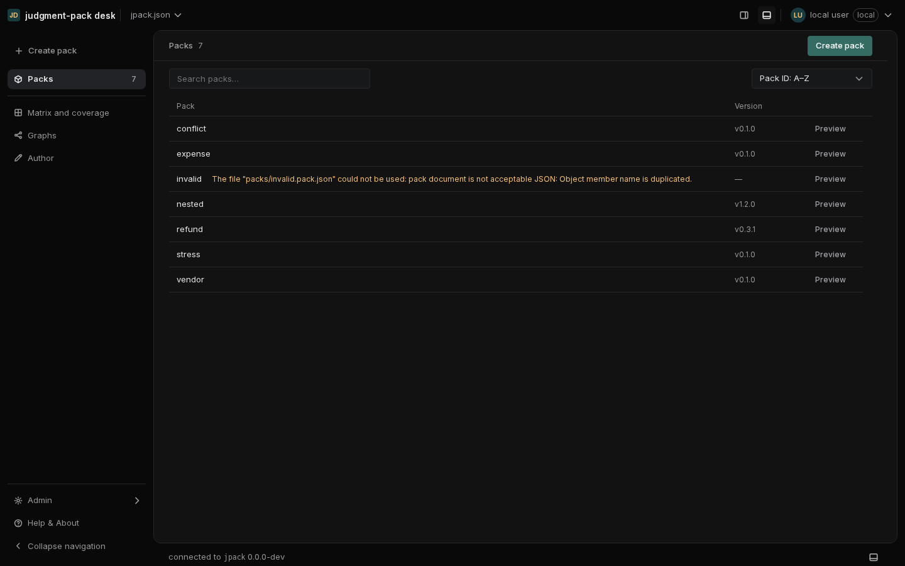
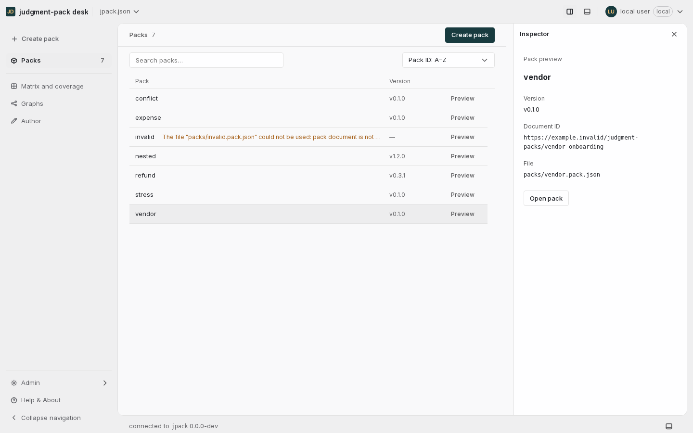
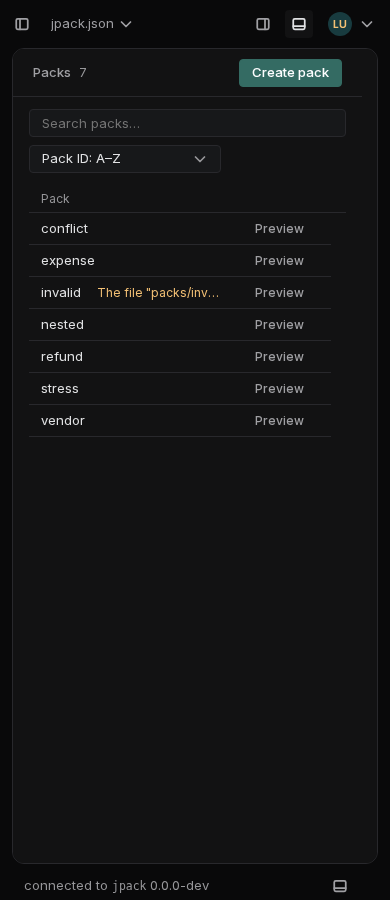
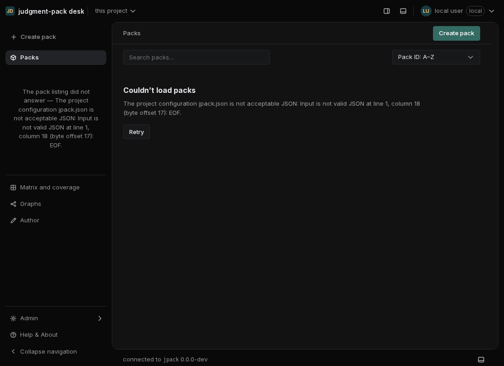

# Packs collection review

September 12, 2026.

## Problem and resulting behavior

The Packs landing page allocated a narrow column to two links while reserving
most of main for “Select a pack,” next to another empty Inspector. Stacked
filter/sort fields, a missing page-level create action, and a “Name” sort over
project IDs made the collection harder to scan than its contents warranted.

The page now gives the collection main's full width. Its shared compact header
contains Packs, the result count and Create pack. Search and an explicit Pack ID
sort share a wrapping row. Rows contain the ID, optional description, available
version and a separate Preview action. There are no invented health, activity
or modification-date columns.

| Interaction | Result |
| --- | --- |
| Select a pack name | Open its Overview using a native link. |
| Select Preview | Show supplied inventory metadata in the shared Inspector without fetching or evaluating a document. |
| Return from a pack | Restore search, ordering, preview selection and list scroll. |
| Open a pack from a phone preview | Close the modal Inspector so the document is visible. |
| Search without matches | Show a distinct no-results state with Clear search. |
| Empty project | Show No packs yet, with one Create pack action in the page header. |
| Loading or failed inventory | Show an explicit loading state or an error with Retry; do not present stale rows or claim zero packs. |

The default Inspector stays closed. Explicit and saved pane preferences remain
effective. A manually opened Inspector gives a collection-specific preview hint.
The hidden collection releases its Inspector publication and page-layout marker
while a document is active.

## Design system and references

This uses the existing `PageHeader`, `Input`, `Select`, `Button`, `ButtonLink`,
Inspector slot, density tokens and windowing. The shared header supports subdued
count metadata and explicitly leaves the banner landmark to the shell. There are
no new packages or literal component colors.

Rows use the existing 40px comfortable / 32px compact heights, 13px names and
12px metadata. Selection backgrounds and selected text stay neutral. Green is
reserved for existing action/focus tokens; runtime warnings use the gold token.
Headers and rows reserve the same scrollbar gutter, keeping versions aligned.
The 12px outer workspace gutter and existing pane resizing remain intact.

At narrow widths, controls wrap and version/description move to preview. Long
IDs and warning text truncate in a row but are available in full in preview.
When the Console leaves little vertical space, main scrolls and at least three
rows remain reachable. All entries remain available through virtualization,
without a second Show all step; arrow keys, Home and End preserve the focused
link or Preview column.

The direction follows Linear's [design refresh](https://linear.app/now/behind-the-latest-design-refresh):
quieter boundaries, reduced chrome and consistent control placement. Its
[project navigation](https://linear.app/docs/projects) and
[display options](https://linear.app/docs/display-options) informed a collection
that opens a focused detail page and offers optional supporting detail. These
are adapted interaction and layout principles, not a claim to reproduce a
private Linear component library.

## Verification

- Production TypeScript/Vite build passed.
- All 122 web test files / 3,000 tests passed, including inventory failure,
  empty versions, windowed keyboard navigation, preview ownership, retained
  collection state and shell landmarks.
- Chromium collection sweep: all 144 layouts and 17 interaction checks passed;
  results recorded in
  [browser-results.json](packs-collection/browser-results.json). Covers light/dark,
  comfortable/compact, 320–1920px widths, Inspector and rail drawer boundaries,
  Console states, a 308-pack inventory, long IDs, doubled root text size, and
  a short viewport. Search, sort and scroll restore together after navigation.
- Four additional [Preview keyboard checks](packs-collection/preview-keys.json)
  passed across the virtualized list: End, Home, arrows and Enter keep focus on
  Preview actions and open Inspector without navigating.
- The separate [state checks](packs-collection/states-results.json) passed loading,
  empty project, failed listing and successful Retry recovery using a temporary
  project. Only that temporary fixture was modified.
- The required application containment audit uses a copied demo project and an
  isolated desk configuration. The final result is recorded in
  [PR #64](https://github.com/Judgment-Pack/judgment-pack-desk/pull/64) before merge.
- Mutation-needle inspection checked 885 rows. The five updated collection
  needles match; eight stale needles and one ambiguous needle remain in
  unchanged shell/document/backend code from the base branch. The full mutation
  suite was not run.

Browser coverage is Chromium. Captures show synthetic fixture data, including
one deliberately unreadable pack to exercise warning and missing-version UI.

## Browser captures

