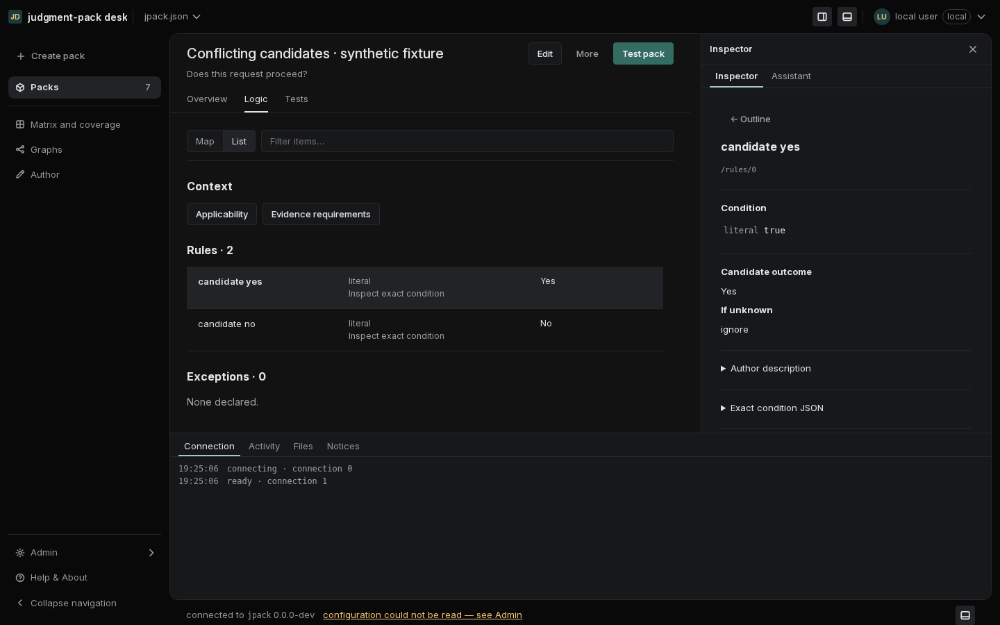
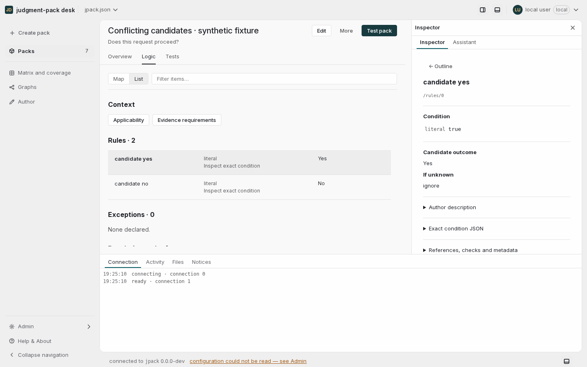
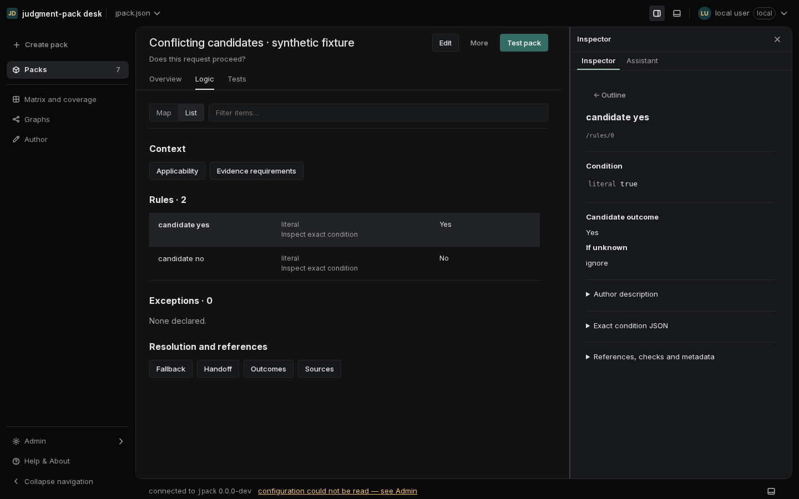
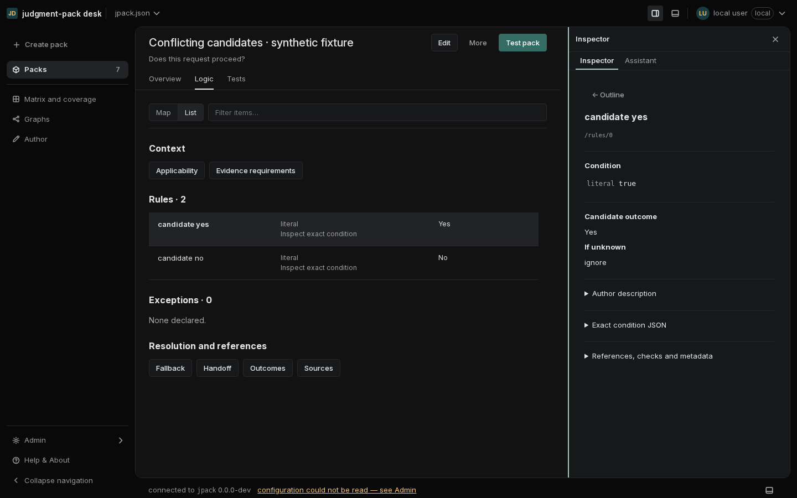

# Pane controls and connection chrome review

September 12, 2026. Follow-up to the Inspector resize change in PR #62.

## Findings and decisions

| Finding | Cause | Shared design rule |
| --- | --- | --- |
| Three green lines around the divider | The 12px hit area had a rectangular focus outline in addition to its center line | Paint only the 2px center line. The larger hit area remains invisible. |
| Green remains after a pointer drag | Programmatic focus can inherit the browser's keyboard-focus state | Track keyboard focus separately from dragging. Pointer input clears keyboard paint; keyboard use restores it. |
| Pane buttons disagree about selection | Pressed toggles had a green border; expanded buttons were absent from the selection selector | One neutral fill and normal icon color for pressed and expanded controls, including the left drawer and footer Console. |
| Two persistent connection indicators | The header badge duplicated the bottom status strip | Keep persistent connection text in the footer. Main connection notices and Admin diagnostics remain available. |
| Hover adds unnecessary button outlines | Icon buttons changed border color on hover | Use a quiet neutral hover fill, without adding a border. Keyboard focus keeps its separate visible ring. |

The divider remains a subtle ordinary boundary at rest. Mouse hover and dragging
paint one neutral line; keyboard focus paints that same line green. Releasing a
mouse drag while still over the divider leaves the neutral hover cue until the
pointer leaves. Touch never acquires a hover highlight. Cancel, lost capture and
blur retain their cleanup behavior. Width bounds, persistence, reset gestures,
page state, the console boundary and the 12px outer gutter are unchanged.

The shell's existing `.desk-icon-button` rule is the shared owner of these
button states. It covers both `aria-pressed` and `aria-expanded`; no individual
pane overrides the selected color. The neutral selection and focus tokens come
from the existing palette, with no new color literals or dependencies.

## Reference review

Linear's [March 2026 design refresh](https://linear.app/now/behind-the-latest-design-refresh)
prioritizes softer separators, less prominent supporting navigation, consistent
control placement and fewer decorative icon treatments. Its comparison
screenshots support the quieter neutral direction used here. The earlier
[personalized sidebar/settings update](https://linear.app/changelog/2024-12-18-personalized-sidebar)
remains the reference for navigation structure.

Those screenshots do not establish Linear's pointer or focus implementation.
For the interaction pattern, VS Code's public
[splitter stylesheet](https://github.com/microsoft/vscode/blob/main/src/vs/base/browser/ui/sash/sash.css)
uses one pseudo-element strip, transparent at rest and highlighted during hover
or active resizing. This desk retains its own neutral/green tokens and larger
hit target. This is an adaptation, not a claim to reproduce Linear's private
component library.

The [WAI-ARIA window splitter pattern](https://www.w3.org/WAI/ARIA/apg/patterns/windowsplitter/)
provides the existing separator semantics and keyboard behavior. Keyboard focus
remains visible; removing the accidental pointer outline does not remove keyboard
resizing or its indication.

## Verification

- Production build and all 121 web test files / 2,993 tests passed.
- The updated header regression assertion and extraction guards passed: 22 tests.
- `scripts/pane-controls-check.mjs` checks the actual browser paint and interaction
  transitions. All 50 checks passed across light/dark and comfortable/compact,
  including text-field-to-drag, keyboard-to-pointer, keyboard reuse, Tab entry/exit,
  neutral pressed/expanded controls, the narrow left drawer, touch end and cancel.
- Running the same checks on the prior UI reproduced 20 failures, including the
  lingering keyboard highlight, three-line focus treatment, duplicate connection
  indicator and inconsistent pane selection. The updated UI has zero failures
  and zero page errors.
- The required 480-configuration application containment gate is run separately;
  its final result is recorded in the pull request before merge.

The [browser results](pane-control-states/results.json) contain the measurements.
Coverage is Chromium; the screenshots are browser captures from a synthetic pack
project, not generated mockups.

## Captures

