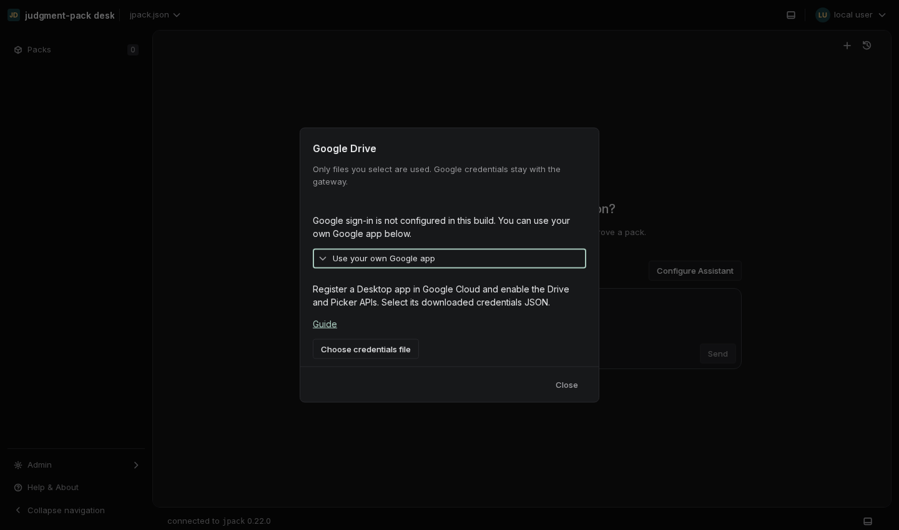
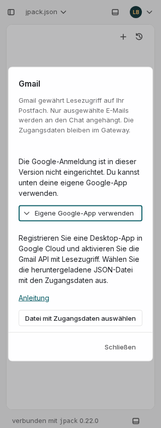

# Personal connections from the composer

Selecting Google Drive or Gmail from **+** now keeps the user in chat. A shared
personal dialog explains access, starts browser OAuth, and returns to file/email
selection. The account menu offers **My connections** for account management.
Admin's former Connections section is removed; local document/gateway preferences
are under Storage & data, with old fragments retained as aliases.

The [ChatGPT documentation](https://learn.chatgpt.com/docs/plugins) describes
prompting for service authentication at installation or first use. Its
[workspace controls](https://learn.chatgpt.com/docs/enterprise/apps-and-connectors)
are distinct from a person's account authorization. The supplied composer
screenshot informs the entry point; exact ChatGPT menus vary by surface.

## Registration remains a release prerequisite

There is no publisher-owned Google OAuth registration bundled with Desk. These
screens truthfully disclose that state and place the custom Desktop app JSON
import under **Use your own Google app**. They cannot create a Google Cloud
registration by requesting user consent. A configured installation instead offers
Continue, opens Google from that user gesture, and resumes content selection.

OAuth, credential custody, scopes, selected-resource grants, and retrieval remain
in the existing gateway companions. No real Google account was connected in this
review. All browser provider replies were synthetic; no chat or personal files
were supplied to Google.

## Validation

- Production web build, TypeScript, localization coverage, and UI source guard.
- Full web suite: 3,620 passed, one skipped before the final nested-dismissal fix;
  focused connection regressions pass after that fix, including a new test for
  one-layer Escape and opener restoration.
- 147 built-app browser checks: 12 locales, widths 320/390/1440, dark/light themes,
  Drive and Gmail, bounded dialogs, no text overflow, draft retention, and focus.
- Simulated registration import stays in chat and does not start OAuth without a
  fresh click. Gmail authorization returns to email selection automatically.
- Account management returns to its list on Escape; legacy Admin links open
  document processing under Storage & data.
- Component tests cover cancellation on close/configuration change, late OAuth
  results, closed-during-file-read, and incomplete remote revocation.

Shared Dialog, Disclosure, SettingRow, Button, and existing design tokens are used;
no new color, typography, or spacing overrides were introduced.

The screenshots show the advanced setup fallback, using synthetic settings:

