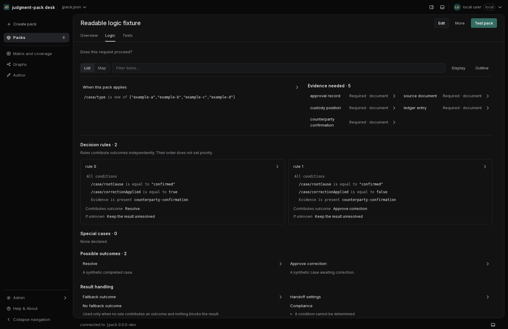
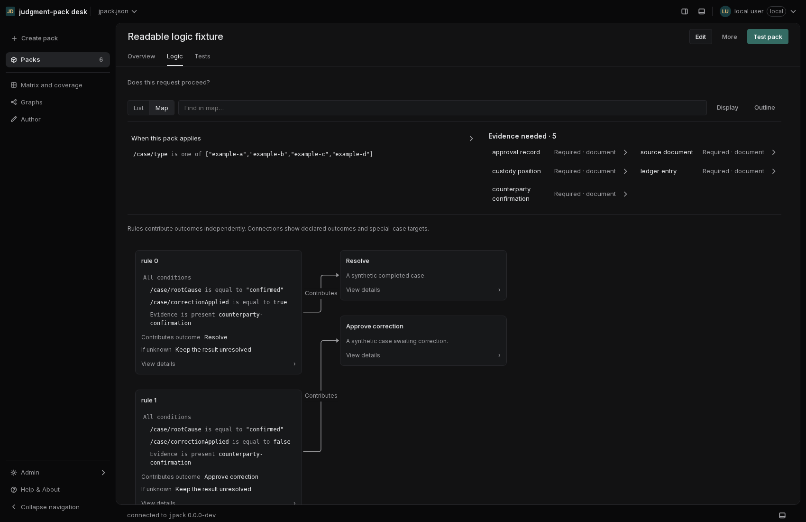

# Readable pack logic

The category Map and summary-only List required several Inspector selections to
understand a rule. Both views now expose scope, evidence requirements, actual
conditions, outcomes, unknown behavior and result handling directly. The
Inspector provides reasoning, descriptions, references, technical values and
checks. No evaluation or saved-pack behavior changes.

The List is the first-time default; saved Map/List preferences still apply.
Two rule cards can be compared beside one another on wider panes. The Map has
one node per rule, special case and outcome, with measured heights. Connections
come from exact declared outcome IDs and exclusion targets. Rule order never
establishes priority, documentary references are not execution prerequisites,
and handoff requests remain distinct from outcomes and confirmed delivery.

Display remembers condition visibility and optional grouping by outcome. A
rule targeted by an exclusion remains individually addressable. Groups expand
on the canvas and retain mixed recorded-condition counts. Search shows matching
conditions even in compact mode, highlights without panning on each keystroke,
and advances with Enter / Next match. Switching representations retains the
selected pointer, List position, viewport and Inspector mode/preference.

The implementation uses the existing neutral palette, type and spacing tokens,
InspectionRow, Radix-backed Popover, shared controls and ConditionTree. The
List scrolls within PageBody, with a sticky Logic toolbar and the page header
outside the scroll region. The design-system contract has been updated.

## Screenshots

These use the browser script's synthetic fixture; no user configuration or
project content is included.





## Verification

- Production frontend build and TypeScript check passed.
- Full web suite: 3,081 tests passed; an additional grouped-trace regression
  and the affected component/route tests passed after the final trace refinement.
- Go vet and Go tests passed. Localhost test servers require execution outside
  the filesystem/network sandbox.
- Browser sweep: light/dark, 360/640/1100/1700px, sticky headers/toolbars, preserved
  List position, direct inspection, search highlighting/jumping, persistent
  display choices, 80 rules, 12 nested long condition groups, and 200% text.
  No browser errors, node overlaps or page horizontal overflow were found.
- The mutation-needle audit reports seven existing stale rows and one ambiguous
  needle, also present on the original main branch. This change adds no drift.

[Browser results](readable-pack-logic/verification.json) are checked in alongside
these screenshots. Run the same synthetic fixture again with:

```sh
npm --prefix web run build
go build -o /tmp/jpack-desk .
PLAYWRIGHT_CHROME=/path/to/chrome node scripts/readable-logic-check.mjs \
  /tmp/jpack-desk /path/to/enterprise-demo /path/to/jpack /tmp/readable-logic
```

The browser script copies the supplied project, uses a disposable configuration
and launch credential, and stops only its own local server. It currently uses
port 8821. The separate repository-wide stylesheet gate is
`scripts/containment-check.sh`; its complete demo needs packs, matrices and a graph.

This applies Linear's published guidance on
[content hierarchy](https://linear.app/now/behind-the-latest-design-refresh),
[display preferences](https://linear.app/docs/display-options), and
[overview/sidebar access](https://linear.app/docs/project-overview). These are
pack-specific design decisions, not claims about Linear's private design tokens.
