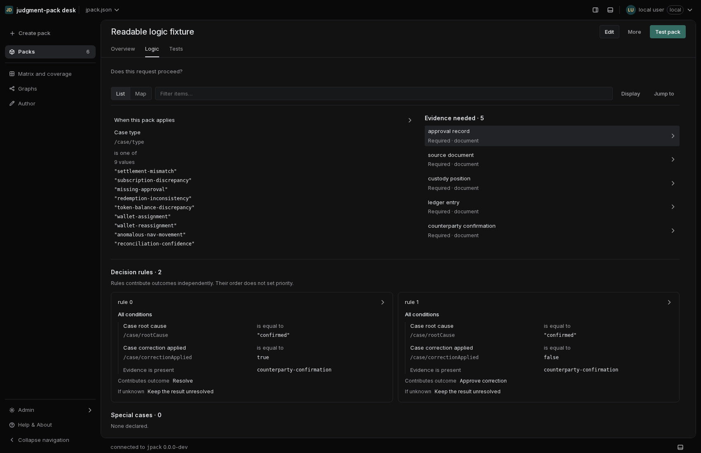
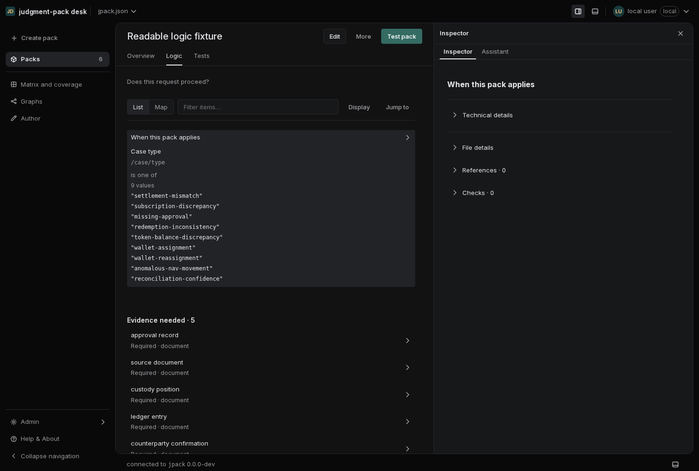
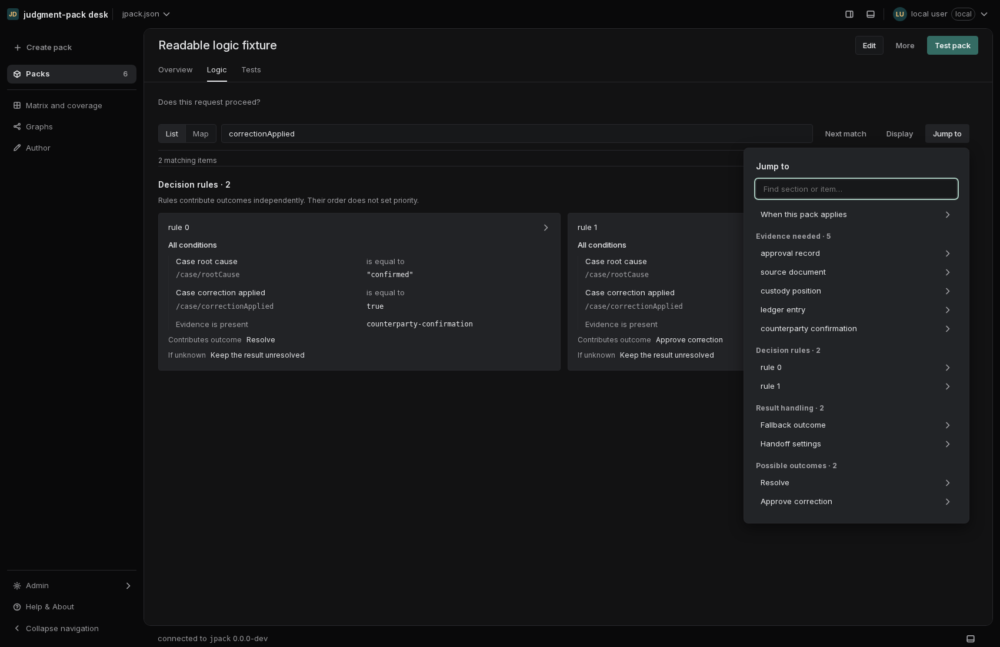
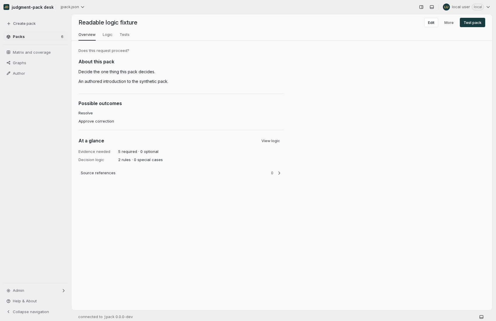

# Structured conditions and distinct reading views

The Logic list exposed definitions but still printed scope operands as one
serialized array. A two-column evidence grid nested inside the context column
left names with only a few characters of width. The persistent Inspector outline
repeated the main list, while its detail mode repeated the condition itself.
Overview also repeated configuration that now belongs in the detailed Logic view.

## Result

- `ConditionTree` has a shared structured reading presentation for Logic List,
  Map and applicable Inspector definitions. It separates field, comparison and
  operands. Every array entry occupies its own row; strings keep their quotes,
  numeric/boolean/null values keep their types, and order is preserved. Mechanical
  labels accompany exact paths. All/Any/Not groups retain explicit nesting.
  Unknown nodes remain readable as exact JSON, and absent operands are explicit.
- Evidence has one full-width row with requirement/type below its name. Context
  and rule columns stack below a 54rem Logic container. No page-specific palette
  or smaller typography was introduced.
- `PackJumpTo` replaces the persistent Outline. Its shared Radix popover searches
  the complete projection, clears a conflicting main filter, dismisses and focuses
  the item in the main view. Grouped map targets expand before measurement/focus.
- Map selection preserves Inspector visibility and the Assistant tab. Native
  View details buttons open supporting information. Existing row detail actions
  and explicit pointer/group deep links remain available.
- Detailed Logic inspection omits repeated conditions, contributed outcomes,
  unknown handling and primary definitions. Reasoning, references, checks,
  provenance and exact JSON remain available. Conditions return in compact mode
  or when a List filter hides the selected item. No selection shows pack metadata.
- Overview now shows authored purpose/description, a short outcome list, aggregate
  counts, source access and View logic. Scope, evidence members and fallback/handoff
  configuration belong in Logic. Exact duplicate context/question paragraphs are
  omitted. Outcome names/counts are intentional orientation, not a second rule list.

This applies Linear's [content hierarchy](https://linear.app/now/behind-the-latest-design-refresh),
[structured filters](https://linear.app/docs/filters), and
[optional details sidebar](https://linear.app/docs/project-overview) to the pack
reader. It does not claim that Linear forbids all repetition or publishes these
pack-specific components. The shared tokens and controls remain authoritative.

## Verification

- Full component suite: 3,089 passed; final affected tests: 59 passed, including
  the added filtered-selection regression. Typecheck and production build passed.
- Go vet and Go tests passed. No Go source or runtime evaluation behavior changed.
- Cross-page containment gate: 435/435 configurations passed across 15 routes
  and nine viewport widths. The disposable project remained unchanged.
- Real Chromium: light/dark, comfortable/compact, 360/640/1100/1700px, 1480px with
  the Inspector at minimum/maximum widths, 200% text, 80 rules, nested long operands,
  grouping, keyboard selection and Jump to focus. No page errors, horizontal List
  overflow or overlapping map nodes. Evidence names were measured for line count,
  not only container overflow.
- The browser pass caught a grouped-node focus race: React Flow mounted the
  expanded target after the focus request was consumed. Focus now waits for the
  actual measured node, and the grouped navigation regression passes.

Run `scripts/readable-logic-check.mjs` with a built desk, complete demo project,
runtime binary and optional artifact directory. It uses a disposable project,
configuration and launch session. The committed images contain synthetic fixture
data; no personal project or session is included.

[Browser results](structured-pack-reading/verification.json)

